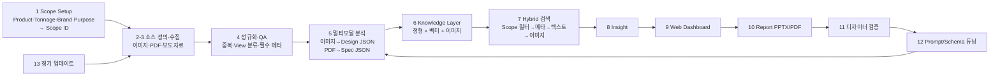

# Design Benchmarking Agent — 프로젝트 기획서

| 항목 | 내용 |
|---|---|
| 리포 | data09-10 |
| 제출자 | 이동철 |
| 직무·소속 | Exterior & Interior Design / 디자인팀(연구개발) |
| 과정 | 현장 데이터 디지털화 전문가과정 1차수 |
| 작성일 | 2026-09-28 (v0.2 · v0.3 · v0.4 · v0.5 개정 2026-09-29, v0.6 · v0.7 · v0.8 개정 2026-09-30) |
| 문서 상태 | 초안 v0.8 — 2026-09-30 오후 팀 기준 비중 없음 확정 → 예시 프로필을 기본값으로, 「비중 조정」 패널(막대·숫자 자동 100%·리포트 목적 출발점·내 비중으로 저장) 추가 (11장 v0.8). 이전: v0.7 — 2026-09-30 오전 늦게 이미지 View 에 Rear-Quarter 추가 · 비중 질문 다시 쓰기 · 모델별 Radar 불필요 확인 (11장 v0.7). 이전: v0.6 2026-09-30 보고서 목적별 비중 프로필(버전 관리)·Radar Chart·내 PC 에서 쓰기 안내·수강생 질문 4개 답변 (11장 v0.6). 이전: 수강생 제출 자료 + 2026-09-29 추가 요청(Mecalac·Insight·Report·전문가 피드백·운영 루프) 반영, 추가 과제 B(자동 업무보고 Agent), 오후 답변(평가 포함 리포트·주간·Mecalac 전 장비) 확정, 오후 늦게 평가 기준 자료(8기준·비중·1~5)·오래된 자료 20년·피드백 1~5 확정, 사내 LLM(OpenAI 호환) 연결 설정 (11장) |

> **이 리포에는 과제가 두 개 있습니다.** 이 문서는 **과제 A — Design Benchmarking Agent** 입니다. 2026-09-29 에 추가로 제출한 **과제 B — 자동 업무보고 Agent** 는 [`docs/02_과제B_업무보고Agent_기획서.md`](02_과제B_업무보고Agent_기획서.md) 에 따로 정리했습니다(11장 끝 「추가 제출 — 과제 B」).

> 제출자는 이미 15쪽 분량의 구축 기획서(Revision 3.0, 2026.09.19)와 13개 화면짜리 웹 프로토타입(HTML + 화면 캡처 13장)을 냈습니다. 이 문서는 그 내용을 **개발 명세로 옮기면서, 지금 가진 자료로 먼저 만들 범위를 좁히는 것**에 초점을 둡니다.

---

## 1. 추진 배경과 현안

Design Research 단계의 경쟁사 Design Benchmarking을 자동화하려는 과제입니다.

현재는 경쟁사 웹사이트·카탈로그·전시회·보도자료·이미지·스펙 시트를 개별로 검색·다운로드·분석합니다. 수치 제원 매핑, 캡 시야성·비례 분석, CMF 트렌드 추적에 시간이 많이 들어 선행 디자인에 쓸 시간이 줄어듭니다.

제출자가 정리한 Pain Point:

| Pain Point | 현상 | Agent 도입 방향 |
|---|---|---|
| 자료 분산 | 웹/PDF/이미지/보도자료가 서로 다른 위치에 존재 | Collection Agent + 중앙 Knowledge Layer |
| 뷰·스케일 불일치 | 촬영각과 표현 방식이 달라 실루엣·비례 비교가 번거로움 | View Taxonomy + Normalization |
| 정성 정보 비표준화 | "강인함", "슬림한 필러" 등 디자인 언어가 개인별로 다름 | 표준 Taxonomy / Schema / Labeling |
| 재사용성 부족 | 개인 PC·PPT 중심 축적 | 검색 가능한 DB + Vector Index |
| 근거 연결 부족 | AI 분석과 실제 제원·원문이 분리 | Source / Evidence / Confidence 필드 |
| 업데이트 비용 | 신제품 출시·변경 시 동일 조사 반복 | Scheduled Update + Change Detection |

## 2. 목표

### 최종 목표

"경쟁사 장비 이미지를 모아 보여주는 사이트"가 아니라, 사용자가 Benchmarking 시작 시 **Product Type · Tonnage · Competitor Brands · Benchmark Purpose**를 고르면 그 Scope에 맞는 데이터를 수집·분석·검색하고 디자인 의사결정을 지원하는 **Design Research & Decision Support System**입니다. 제출자 기대산출물은 Web 페이지 형태의 Benchmarking Agent로, 다음 네 가지를 포함합니다.

- 자료 수집 및 보유 데이터 Status Dashboard
- 경쟁사별 Exterior & Interior 비교 분석 페이지
- Benchmarking Report 생성
- 정기 업데이트

### 1차 개발 목표

제출 기획서의 Phase 1(PoC) 중 **자동 수집(크롤링)과 VLM 분석을 뺀 "지식 베이스 + 탐색·비교 화면"** 을 먼저 만듭니다.

- Scope Setup(14개 경쟁사 — 부록 B 13개사 + Mecalac(v0.2) · Excavator/Wheel Loader · 장비군별 Tonnage · Purpose) → Scope ID 생성
- 디자이너가 이미 가진 자료(이미지·PDF·엑셀)를 **표준 Schema에 맞춰 등록**하는 화면과 엑셀 일괄 가져오기
- Status Dashboard(브랜드×Tonnage별 보유 자료 현황), Card Gallery, Side-by-Side 비교, Detail(근거·출처)
- 선택 모델로 Benchmark 요약표를 만들어 내보내기

## 3. 보유 데이터

| 데이터 | 형태 | 규모·주기 | 비고(민감도 등) |
|---|---|---|---|
| 경쟁사 이미지 | JPEG / PNG | 미확인 | 촬영각(View)이 제각각. 이미지 사용권은 법무 검토 대상이라고 제출자가 명시 |
| 카탈로그·스펙 시트 | PDF | 미확인 | 제원(운전중량·엔진출력·치수·버킷용량 등) 추출 원천 |
| 정리 자료 | 엑셀 파일 | 미확인 | 열 구성 미확인 |
| 각종 문서 | 문서 파일 | 미확인 | 개인 PC·PPT 중심 축적(제출 기획서) |
| On-line 보도자료 | 웹 | 수시 (정기 업데이트 대상, 주간/월간 제안) | 공개 자료이나 수집·저장·재배포 범위 검토 필요 |
| 경쟁사 Universe | 목록 | 14개사 | CAT, Komatsu, XCMG, John Deere, Liebherr, Sany, Volvo CE, Hitachi, JCB, Bobcat, Kubota, Yanmar, Kobelco (부록 B 13개사) + **Mecalac (2026-09-29 수강생 요청, 11장)** |
| Tonnage 분류 | 표 | Excavator 6단계 · Wheel Loader 5단계 | 부록 C. 예: Medium Excavator 10톤~35톤 미만, Medium Wheel Loader 12톤~25톤·버킷 2.5~5.0 m³ |
| 데이터 Schema 초안 | 필드 목록 | 10개 블록 | Identity / Source-Provenance / Media / Design / Cabin-HMI / CMF / Engineering / Service-Safety / AI-Evidence / Benchmark Scope (6절) |

> 웹 프로토타입의 모델명·이미지는 README에 "representative/generated UI data"라고 적혀 있어 실제 수집 데이터가 아닙니다.

## 4. 해결 방안 개요

제출 기획서의 흐름: 초기 Benchmark Scope 선택 → 경쟁사/톤수별 데이터 수집 → 구조화·멀티모달 분석 → Hybrid Retrieval/RAG → Web → Report → 검증·튜닝 → 정기 업데이트.

**1차 개발 범위**: 위 흐름에서 1(Scope) → 수동 등록(2-3 대체) → 4의 필수 메타 점검 → 6(브라우저 내 저장) → 7의 필터 검색 → 9(대시보드) → 10(요약표 내보내기). 5·8·12·13은 2단계 이후입니다.

설계 원칙(제출 기획서): **제원(FACT)과 AI 관찰(OBSERVATION)을 분리하고, 원본 출처·evidence·confidence를 함께 저장합니다.** 1차 개발에서도 이 구분을 데이터 구조에 그대로 둡니다.

## 5. 주요 기능

| 기능 | 설명 | 우선순위 |
|---|---|---|
| Scope Setup | Product Type(Excavator/Wheel Loader) 선택 시 해당 Tonnage 옵션만 표시, 14개사 Multi-select(v0.2 Mecalac 추가), Purpose 선택 → Scope ID 생성 | MVP |
| 자료 등록 | 모델 1건 = Identity + Engineering(FACT) + Design/CMF/Cabin 태그 + 이미지(View 지정) + Source URL·수집일 | MVP |
| 엑셀 일괄 가져오기 | 기존 엑셀 정리 자료를 열 매핑해 Schema로 변환 | MVP |
| 필수 메타 점검 | brand/model/category/collected_at/source URL/image path 누락 표시(Data Completeness) | MVP |
| Status Dashboard | 브랜드 × Tonnage별 보유 모델 수·이미지 수·View 보유 현황·최근 수집일 | MVP |
| Card Gallery | 이미지 Grid + 핵심 스펙·태그, Scope·브랜드·연식 필터 | MVP |
| Side-by-Side | 선택 모델 2~4개의 이미지(같은 View끼리)·CMF·Cabin·Spec 나란히 비교 | MVP |
| Detail / Evidence | 원본 이미지, 제원, 태그, Source URL, 입력자·검증 상태 | MVP |
| Report 내보내기 | 선택 모델 비교표를 Excel·인쇄용 PDF로 출력 | MVP |
| Insight 페이지 (v0.2) | 브랜드별 요약·평가 점수 비교·강약점·Design Tag 트렌드·White Space, AI 요약 반자동 | MVP(v0.2) |
| Benchmarking Report (v0.2) | 인사이트·비교·피드백·운영 상태를 묶은 보고서 화면, 인쇄·PDF·xlsx·HTML | MVP(v0.2) |
| 전문가(디자이너) 피드백 (v0.2) | 리포트 항목·모델별 평가(1~5)·코멘트·작성자·시각 기록, 반영 상태 | MVP(v0.2) |
| 정기 업데이트·운영 루프 (v0.2) | 주기·마지막 갱신일·다음 예정일, 오래된 자료 경고, 사이클 단계 체크·이력 (자동 재수집은 확장) | MVP(v0.2) |
| Moodboard | 이미지 Pinning, 그룹화, 메모, Export | 확장 |
| Trend Matrix | 연식/브랜드/장비군별 CMF·Design Tag 변화 | 확장 |
| VLM 분석 | 이미지 → Exterior/Cabin/CMF JSON, confidence, "AI observation" 표시 | 확장 |
| Spec Extractor | PDF 카탈로그 → 운전중량·출력·치수·버킷용량 JSON, 원문 대조 | 확장 |
| Hybrid 검색·Insight Chat | 자연어 질문 + Scope 필터 + 텍스트/이미지 유사도, 근거 연결 요약 | 확장 |
| 자동 수집 | OEM 공식 사이트·Press 포털 수집 + provenance | 확장 |
| 정기 업데이트 | 주간/월간 재수집, 신규 모델 감지, 변경분 재분석 | 확장 |
| Designer Validation → Tuning | 검수 로그를 Prompt/Schema/Taxonomy 개선으로 되먹임, 버전관리 | 확장 |
| PPTX 자동 생성, 권한·감사 로그 | Enterprise 단계 | 확장 |

## 6. 기대 산출물

제출 기획서 17절의 11개 산출물 중 단계별 대응:

| 제출 기획서 산출물 | 1단계 | 이후 |
|---|---|---|
| 01 Benchmarking Knowledge Base | 수동 등록·엑셀 가져오기 기반 KB (Scope ID 포함) | 임베딩·벡터 색인 |
| 02 Data Collection Agent | — | 자동 수집 + provenance |
| 03 Normalize & QA Module | 필수 메타 누락 점검 | 중복 제거·View 자동 분류·Review Queue |
| 04 Multimodal Analysis Agent | — | 이미지/문서 → JSON |
| 05 Retrieval & Insight Agent | 조건 필터 검색 | Hybrid Retrieval + 인사이트 |
| 06 Web Dashboard | Scope·현황·Gallery·Side-by-Side·Detail | Moodboard·Trend·QA Admin |
| 07 Report Generator | 비교표 Excel/PDF | PPTX 자동 생성 |
| 08~10 Tuning·Scheduled Update·QA & Governance | Schema 버전 표기만 | 전체 |
| 11 DX Roadmap | 과정 DAY6 산출물 | — |

## 7. 기술 구성

| 과정 도구 | 적용 (제출 기획서 16절 기준) |
|---|---|
| DAY1 | Benchmark Scope Selection, Data Inventory, Collection Plan, Labeling Guideline (View·Tag 기준 확정) |
| DAY2 코랩(Python) | Data Cleaning, Standard Schema, 스크립트로 엑셀 자료 정리, Scope별 시각화 |
| DAY3 멀티모달 | Image → Feature JSON, PDF → Structured Data (VLM 분석 PoC) |
| DAY4 RAG(Dify·NotebookLM) | Design Benchmarking Knowledge Base, Insight Agent (카탈로그·보도자료 질의) |
| DAY5 Make | 신규 모델 감지 → 분석 → 대시보드 갱신 → 알림/리포트 |
| DAY6 | ROI, DX Roadmap, Scope 확장 전략 |

**개발 형태**

- 제출 기획서는 PoC를 Streamlit, 고도화를 Next.js/React, 저장소를 PostgreSQL + pgvector, 이미지 저장소를 NAS 또는 S3/R2/MinIO로 제안했습니다.
- **1단계는 설치가 필요 없는 브라우저 기반 정적 웹 도구**로 제안합니다(가정). 제출자가 이미 HTML 프로토타입을 만들었으므로 그 화면 구성과 이어지고, 서버 없이 사내 PC에서 바로 열어 볼 수 있습니다.
  - 데이터는 브라우저 저장소에 두고, **JSON/Excel 파일로 내보내기·가져오기**해 팀원 간 공유합니다.
  - 이미지는 파일로 불러와 브라우저에 보관합니다(용량 한계 있음 — 팀 공용 운영은 2단계에서 저장소 결정).
- 2단계에서 VLM 분석과 자동 수집을 붙일 때 서버가 필요해지며, 그 시점에 제출 기획서의 구성(Python 수집기 + DB + 벡터 색인)으로 옮깁니다. 외부 VLM으로 이미지를 보낼 범위는 사내 보안정책 검토 대상입니다(제출자 명시).

## 8. 개발 단계

### 1단계 — 지금 바로 개발 가능한 부분

제출 자료만으로 확정된 것이 많아 바로 만들 수 있습니다.

1. **Scope Setup 화면** — 13개사 목록(부록 B, v0.2 에서 Mecalac 추가로 14개사), Excavator 6단계·Wheel Loader 5단계 Tonnage(부록 C), Purpose 목록, Scope ID 규칙(프로토타입의 `EXC-MED-006` 형식 참고).
2. **데이터 구조** — 6절 Schema 10개 블록을 그대로 필드로 정의하고 FACT/OBSERVATION 구분, `schema_version` 표기.
3. **자료 등록 + 엑셀 가져오기** — 이미지 View 분류(Side / Front-Quarter / Rear-Quarter / Rear / Cabin / CMF Detail — 18절 예시 + 2026-09-30 수강생 요청으로 Rear-Quarter)를 선택 항목으로.
4. **Status Dashboard · Card Gallery · Side-by-Side · Detail** — 프로토타입 09 Web Dashboard 화면 구성을 따름.
5. **비교표 내보내기** — Excel, 인쇄용 PDF.
6. 시연 데이터는 **가상의 모델명·도형 이미지**로 채웁니다(프로토타입과 같은 방식). 실제 경쟁사 이미지는 사용권 검토 후 제출자가 넣습니다.
7. **(v0.2, 2026-09-29 추가)** Mecalac 추가(14개사), 평가 점수 4축, 07 Insight · 08 Benchmarking Report · 09 전문가 피드백 · 10 운영 루프 — 11장.
8. **(v0.5, 2026-09-29 오후 늦게)** 평가 점수를 수강생 평가 기준 자료의 **8기준·권장 비중·1~5 Scale** 로 교체(디자이너 점수 · AI 점수 · 근거 분리, 가중 점수), AI 1차 평가 프롬프트, 사내 LLM(OpenAI 호환) 자동 보내기 설정 — 11장.

### 2단계

- 코랩에서 PDF 카탈로그 → 제원 JSON 추출(Spec Extractor), 이미지 → Design/CMF 태그 JSON(VLM) PoC. 결과는 "AI observation"으로 표시하고 디자이너가 확정.
- Dify/NotebookLM으로 카탈로그·보도자료 질의(Insight) PoC.
- 팀 공용 저장소 결정(사내 NAS 등), Moodboard·Trend Matrix.
- 제출 기획서 Phase 1 Exit Criteria: "서로 다른 2~3개 Scope 조합에서 핵심 Use-case가 정상 작동하고 결과의 근거 추적이 가능".

### 3단계

- 자동 수집 + 정기 업데이트(Make 또는 스케줄러), 신규 모델 감지, Hybrid Retrieval(Scope 필터 → 메타 → 텍스트 → 이미지 벡터), Designer Validation → Tuning 루프, PPTX 자동 생성, 권한·감사 로그 (제출 기획서 Phase 2·3).

## 9. 기대 효과

- 흩어진 경쟁사 자료가 Scope 기준으로 한곳에 모이고 다시 쓸 수 있게 됩니다.
- 디자인 언어·태그가 표준 Taxonomy로 통일되어 개인별 표현 차이가 줄어듭니다.
- 모든 비교 결과에 출처·근거가 붙어 보고와 의사결정 근거가 명확해집니다.
- 신제품 출시 때마다 같은 조사를 반복하던 비용이 정기 업데이트로 줄어듭니다.
- 제출자는 절감률을 수치로 제시하지 않았고, **PoC에서 같은 과업의 Before/After를 직접 측정**하겠다고 했습니다. ROI 기본식: (Before Hours − After Hours) × 적용 건수 × 시간당 인건비 − 시스템 운영비용.

## 10. 확인 필요 사항

1. 제출 기획서 부록 A가 근거로 든 원문 자료(`Automotive Design Benchmarking Scope.docx`, `Benchmarking Agent 기획 자료-01~03.docx`, `Excavator _ Wheel loader 등을 제조하는 건설장비 디자인에서 주로 다루.docx`, `건설기계 주요 경쟁사.docx`, `굴착기, 휠로더의 Tonage별 구별.docx`)는 이번에 받지 못했습니다. 특히 **Design Tag·Taxonomy 세부 목록**이 담긴 문서가 있으면 받고 싶습니다.
2. 현재 보유 자료의 규모 — 브랜드별 이미지 수, PDF 수, 엑셀 파일의 열 구성 샘플 1건.
3. 1단계 시연용 실제 자료 1~2개 Scope 분(예: Medium Excavator × 3개사) — 사내 사용 범위 안에서.
4. 표준 Design Tag 초안(4대 분석축 + Serviceability/Safety 보조축의 태그 목록) 확정 여부.
5. Image View Taxonomy 최종안(18절 예시 5종으로 충분한지). → 2026-09-30 수강생 요청으로 Rear-Quarter 를 더해 6종 + 기타(11장 v0.7).
6. Scope ID 규칙 확정(프로토타입의 `EXC-MED-006-TT`, `SB-2026-0919-001` 두 형식 중 무엇을 쓸지).
7. 1단계를 팀원이 함께 써야 하는지(공용 저장소 필요) 아니면 개인 PC 도구로 시작해도 되는지.
8. 경쟁사 웹 데이터 수집·이미지 사용권, 외부 VLM 전송 범위에 대한 법무/보안 검토 진행 상황(제출자 명시 사항).
9. Benchmark Report의 현재 양식(PPT 1장 보고 등) 샘플.

## 11. 2026-09-29 수강생 추가 요청

### 원문 (패들릿, 2026-09-28T23:59Z 「Agent Proto」 게시물 댓글)

> - 주요 경쟁사에 'Mecalac' 1개 브랜드 추가 (13개 브랜드-->14개 브랜드)요청드립니다.
> - BM결과에 대한 인사이트 페이지 / Benchmarking Report / 분석 및 리포트에 대한 전문가(디자이너) 피드백 / 정기 업데이트 및 운영루프 등이 추가되면 좋을 것 같습니다. ( Proto Web 참조))
> - 기획서 기반의 'End to End Process' Proto Web Index를 업로드했습니다.

첨부된 Proto Web(`docs/source/2026-09-29_AgentProto_index.html`)은 1단계 때 받은 프로토타입 zip 안의 `index.html` 과 같은 파일입니다. 13단계 흐름 화면이며 모델명·수치는 프로토타입용 생성 값입니다. 실명·사내 기밀은 없어 원본 그대로 보관했습니다.

### 반영 방식

| 요청 | 반영 | 비고 |
|---|---|---|
| Mecalac 추가 (13 → 14개사) | 경쟁사 목록(`js/logic.js` BRANDS)·예시 데이터(가상 모델 1건 `예시-MW12`)·DB 제약(`supabase/schema.sql`)·검증 하네스·README·이 문서를 모두 갱신. 화면의 개수는 목록 길이에서 계산 | 본사 표기 「프랑스」, 별칭 메카락·메칼락 |
| 인사이트 페이지 | 메뉴 **07 Insight** — 브랜드별 요약(모델 수·평가 평균·운전중량 범위·출력 대비 중량·주요 태그·최근 수집일), 점수 비교(축 평균 대비 차이), 강·약점 자동 추출(±0.5점, 출력 대비 중량 ±10%), Design Tag 트렌드, White Space, 요약 코멘트 | 점수를 매길 칸이 없어 **디자이너 평가 점수 4축(1~5)** 을 Schema 에 추가(v0.2). 인사이트 문장은 AI 없이 계산으로 만들고, AI 요약은 반자동(프롬프트 복사 → 답 붙여 넣기) |
| Benchmarking Report | 메뉴 **08 Benchmarking Report** — 9개 항목 보고서 화면, 인쇄·PDF 저장, xlsx(8개 시트), HTML 파일 한 개로 내려받기 | PPTX 자동 생성은 3단계 그대로 |
| 전문가(디자이너) 피드백 | 메뉴 **09 전문가 피드백** — 리포트 항목·모델별 평가(1~5)·분류·코멘트·작성자·작성 시각 기록, 「반영됨」 상태 전환. 리포트 각 항목에 「이 항목에 피드백」 버튼 | 기록은 고치지 않고 쌓음(DB 에서도 내용 수정·삭제 불가) |
| 정기 업데이트·운영 루프 | 메뉴 **10 운영 루프** — 주기(주간·격주·월간·분기), 마지막 갱신일·다음 예정일, 수집일 기준 오래된 자료 경고, 사이클 7단계 체크, 완료 이력. 예정일이 지나면 왼쪽 메뉴에 표시 | 자동 재수집·신규 모델 감지는 서버가 필요해 3단계. 지금은 「언제 무엇을 다시 볼지」 알려 주는 방식 |

### Proto Web 흐름과 도구 메뉴 대응

| Proto 단계 | 내용 | 도구 메뉴 | 지금 상태 |
|---|---|---|---|
| 01 Scope Setup | 장비군·톤수·경쟁사·목적 | 01 Scope Setup | 완료 (14개사) |
| 02 Target Sources | 공식 웹·전시·미디어·카탈로그 소스 | 05 자료 등록의 Source 블록(유형·신뢰도) · 10 운영 루프 「수집·등록」 단계 | 소스 자동 구성은 3단계 |
| 03 Collection | 이미지·PDF·텍스트 수집 | 05 자료 등록 · 06 가져오기(엑셀·CSV) | 수동·일괄 가져오기. 자동 수집은 3단계 |
| 04 Normalize & QA | View 분류·중복·필수 메타 | 02 Status Dashboard(필수 메타 누락·톤급 불일치) · 05 중복 차단 · 검증 상태 | 완료 |
| 05 Multimodal Analysis | VLM 4대 축 분석 | 05 관찰 블록 + **평가 점수 4축(v0.2)** · 관찰 입력 출처 「AI 관찰」 칸 | 디자이너 입력. VLM 은 2단계 |
| 06 Knowledge Layer | RDB·Vector·Image Store | 브라우저 저장소 · 06 JSON/Excel 백업 · `supabase/schema.sql` | 벡터 색인은 3단계 |
| 07 Benchmark Retrieval | Hybrid 검색 | 03 Card Gallery 필터(Scope·톤급·브랜드·연식·View·검색어) | 조건 검색 완료 |
| 08 Insight Agent | Trend·Positioning·White Space | **07 Insight (v0.2)** | 계산 인사이트 + AI 요약 반자동 |
| 09 Web Dashboard | Gallery·비교·Moodboard | 02 Dashboard · 03 Gallery · 04 Side-by-Side | Moodboard·Trend Matrix 는 2단계 |
| 10 Report & Decision | PPT/PDF 리포트 | **08 Benchmarking Report (v0.2)** · 04 비교표 내보내기 | PDF(인쇄)·xlsx·HTML. PPTX 는 3단계 |
| 11 Designer Validation | 전문가 확인·피드백 | **09 전문가 피드백 (v0.2)** · 모델 검증 상태(미검토/검토중/확정/반려) | 완료 |
| 12 Prompt / Schema Tuning | Prompt·Taxonomy·Schema 버전 관리 | 09 피드백 분류 「Taxonomy·기준 조정」 · 10 운영 루프 「보정 기록」 단계·완료 메모 · `schema_version` | 버전 관리 화면은 3단계 |
| 13 Scheduled Update | 신규 모델 추적·재수집·재색인 | **10 운영 루프 (v0.2)** | 주기·예정일·오래된 자료 경고. 자동 실행은 3단계 |

### 정한 것(가정)과 남은 확인 사항

1. **평가 점수 축** — Exterior 조형 · Cabin/HMI · CMF · Service/Safety 4축, 1~5 정수. 4대 분석축 중 Engineering 은 제원(FACT)으로 비교하므로 점수 축에서 뺐습니다. 축 구성·척도(1~5 / 1~10)를 확인해 주세요.
2. **강·약점 기준** — 축 평균(모델 단위)보다 0.5점 이상 차이, 출력 대비 중량(kW/t) 10% 이상 차이. 팀에서 쓰는 기준이 있으면 맞춥니다.
3. **리포트 항목 9개** — Proto 10 의 목차(Overview · Data & Scope · Design Trend · CMF · Cabin/HMI · Design Target)와 다릅니다. 현재 보고 양식(10장 9번) 샘플을 주시면 항목을 맞춥니다.
4. **피드백 분류** — Proto 11 의 4종(분석 결과 수정 필요 · 디자인 Tag 보정 · Taxonomy/기준 조정 · 예외 사례 등록) + 「동의(수정 없음)」 · 「추가 분석 요청」.
5. **운영 주기 기본값** — 월간, 오래된 자료 기준 180일. Proto 13 은 주간(월요일 09:00)이었습니다. 팀 운영 주기를 알려 주세요.
6. Mecalac 을 부록 B 와 같은 「주요 경쟁사」로 볼지, 휠형 굴착기·컴팩트 장비 한정으로 볼지(현재는 제한 없이 선택 가능).

### 2026-09-29 오후 답변 반영 (v0.4)

원문(패들릿 댓글, 2026-09-29T02:20Z, 「09-29 반영 결과 · data09-10」 게시물):

> -디자인 평가 지표 및 점수 관련 가이드입니다. 0~5점 구성입니다.-리포트는 디자인 평가 페이지의 내용을 포함해서 평가 페이지를 기반으로 한 Insight를 제공하는 내용이면 될 듯 합니다.-업데이트 주기 ( 주간단위/오래된 자료 15년 )-Mecalac: 모든 장비로 구분

| 확인 사항(위 목록) | 답 | 반영 |
|---|---|---|
| 1. 평가 점수 척도 | **0~5점** | 점수 칸·빠른 입력·가져오기가 0~5 를 받습니다. 0 은 「점수 0」, 빈칸은 「평가 안 함」으로 구분합니다. 예전에 넣은 1~5 점수는 범위 안이라 그대로 유효합니다(데이터 변환 없음). `schema_version` v0.3-stage1, DB 제약 0~5. 축 구성(4축)은 답에 없어 그대로 둡니다 |
| 3. 리포트 항목 | **디자인 평가 페이지 내용을 포함하고, 평가 기반 Insight 제공** | 리포트 항목 10개: 1 Overview · **2 디자인 평가 — 모델별 점수(0~5)** · 3~6 **Insight**(브랜드별 요약 · 평가 점수 비교 · 강·약점 · Design Trend/White Space — 모두 2번 점수로 계산) · 7 요약 코멘트 · 8 선택 비교 · 9 피드백 · 10 신선도·운영. 머리 요약에 「평가 N건/전체, 모델 평균 최고·최저 모델」을 더했습니다. xlsx 에 「디자인평가」 시트 추가(9개 시트). 07 화면의 점수 표 이름도 「디자인 평가 — 모델별 점수(0~5)」로 바꿨습니다 |
| 5. 운영 주기 | **주간 · 오래된 자료 15년** | 기본값 주간·5479일(15년). 기준 상한을 3650일에서 10958일(30년)로 넓혔습니다. 예전 기본값(월간·180일)을 그대로 둔 저장본은 한 번만 새 기본값으로 옮기고, 사용자가 직접 고른 값은 건드리지 않습니다. 예시 데이터도 주간 주기로 바꿨습니다 |
| 6. Mecalac 범위 | **모든 장비로 구분** | 이미 굴착기·휠로더 Scope 어디서나 고를 수 있게 되어 있어 확인됨으로 기록합니다(테스트 추가) |

남은 확인:

1. **디자인 평가 지표·점수 가이드 문서** — 댓글에 「가이드입니다」라고 적혀 있지만 댓글에는 첨부가 없었습니다. 0~5 각 점수의 뜻(예: 0 이 「해당 없음」인지 「매우 미흡」인지)과 평가 지표 목록이 담긴 문서가 따로 있으면 올려 주세요. 받으면 점수 칸 옆에 기준 설명을 붙이고, 축 구성(지금 4축)도 맞춥니다.
2. 「오래된 자료 15년」을 **수집일** 기준으로 적용했습니다. 출시 연도(모델이 나온 해) 기준을 뜻하셨다면 알려 주세요.
3. 전문가 피드백의 평가(1~5)는 디자인 평가 점수와 다른 칸이라 그대로 두었습니다. 같이 0~5 로 맞출지 알려 주세요.
4. 강·약점 기준(2번)·피드백 분류(4번)는 답이 없어 그대로입니다.

### 2026-09-29 오후 늦게 답변 반영 (v0.5)

원문(패들릿, 2026-09-29T05:10Z 댓글 + 녹색 게시물 「BM Agent 평가 점수 기준 자료」 첨부 docx): `docs/source/2026-09-29_패들릿_답변_오후늦게.md`

> -점수 가이드는 하단의 녹색 게시판에 MB AGENT 평가점수 기준 자료로 업도드 했습니다.
> -수집일 기준으로 최장 20년으로 적용하겠습니다.
> - 전문가 피드백은 1~5로 적용하겠습니다.

첨부 docx 「건설장비 디자인 벤치마킹 평가기준 및 평가표 — 8-Criteria Design Evaluation Framework」는 끝까지 읽었고, 실명·사내 수치는 없었습니다. 수강생 팀의 실무 평가 기준 원문이라 **원본은 리포에 넣지 않고** 구조만 `docs/source/2026-09-29_BM평가기준_구조.md` 에 옮겼습니다.

| 확인 사항 | 답 | 반영 |
|---|---|---|
| 평가 지표·점수 가이드(오후 남은 확인 1) | 평가 기준 자료 | **가정(4축) → 자료의 8기준으로 교체.** C1 Exterior Proportion & Stance 15% · C2 Exterior Form & Surface Quality 15% · C3 Exterior CMF & Brand Expression 10% · C4 Interior Architecture & Styling 15% · C5 Interior CMF & Perceived Quality 10% · C6 Ergonomics & Operator Usability 15% · C7 HMI & Control Integration 10% · C8 Design Identity & Differentiation 10% (합 100%). 기준마다 평가 목적·세부 항목·체크리스트(4~5문항)를 화면에 붙였습니다(07 Insight 「평가 기준」, 05 자료 등록 기준 옆 「체크리스트」) |
| 점수 척도 | 자료 4절 5점 Scale | **1~5** — 1 개선 필요 · 2 기본 수준 · 3 경쟁 평균 · 4 우수 · 5 Benchmark 수준. 선택 칸·표·리포트에 수준 이름을 함께 표시합니다. 오후 댓글의 「0~5」는 자료가 오기 전 답이라 자료를 따랐습니다(아래 남은 확인 1) |
| 점수 계산 | 자료 2절 권장 비중 · 6절 | **가중 점수** = Σ(비중 × 점수) ÷ 평가한 기준의 비중 합. 평가하지 않은 기준이 0 점처럼 끌어내리지 않게 비중을 다시 나누고, 「평가한 비중 %」를 함께 보입니다. 브랜드 점수도 같은 방식 |
| AI 평가와 Designer Validation 분리 | 자료 6절 | 기준마다 **디자이너 점수(Designer Validation)** · **AI 점수(AI Analysis)** · **근거/코멘트(이미지 / URL / 분석 근거 / Designer Comment)** 세 칸. 최종 점수 = 디자이너 점수, 없으면 AI 점수(「AI」 표시 — 검증 전). AI 점수를 넣을 때 `prompt_version` 을 기록합니다 |
| 평가표 모양 | 자료 5절 | 07 Insight 「평가표 — 기준 × 브랜드」, 리포트 4번, xlsx 「평가표」 시트를 **행 = 평가 기준, 열 = 가중치 · 브랜드들** 로 바꿨습니다(마지막 행 가중 점수) |
| AI 가 근거 없이 추정하지 않기 | 자료 8절 | **AI 1차 평가 프롬프트**(05 자료 등록 → Design Evaluation 블록): 관찰 기록(Design·Cabin·CMF·Service 글과 태그)만 보내고, 근거가 없는 기준은 점수를 비워 두라고 요구합니다. 제원은 「맥락」으로만, 이미지·출처 URL 은 보내지 않습니다. 답은 1~5 밖·빈 점수를 걸러 AI 칸에만 넣고 디자이너 점수는 건드리지 않습니다 |
| 오래된 자료 기준(오후 남은 확인 2) | **수집일 기준 최장 20년** | 기본값 20년(7305일 = 365 × 20 + 윤일 5), 판정은 원래대로 수집일 기준. 15년 기본값을 그대로 두고 있던 저장본은 한 번만 20년으로 옮기고, 사용자가 고른 값은 그대로 둡니다. 예시 데이터의 오래된 자료 시연(Mecalac 예시)은 20년 넘게 바꿨습니다 |
| 전문가 피드백 척도(오후 남은 확인 3) | **1~5** | 이미 1~5 였으므로 **확인됨**으로 기록합니다(변경 없음) |
| 사내 AI 연결(과제 B 질문과 같은 설정) | — | 06 가져오기·내보내기 「AI 연결 설정」: 주소(Base URL) · 모델 · 키(선택). 사내 온프레미스 LLM 이 OpenAI 호환 API 를 열어 두었다면 07 요약 코멘트·05 AI 1차 평가에서 「설정한 AI 서버로 보내기」로 바로 받습니다. 반자동(복사·붙여 넣기)은 그대로 기본입니다. 자세한 설계는 과제 B 기획서 11장 |

데이터 호환: 예전 4축 점수(v0.2~v0.3)는 지우지 않고 모델의 `legacy_scores` 로 옮겨 상세 화면에 「참고용」으로만 보이며 계산에는 쓰지 않습니다(4축과 8기준이 1:1 로 대응하지 않아 자동 변환하지 않음). `schema_version` v0.4-stage1, DB 는 `supabase/schema.sql` 1-e(8기준 × 디자이너·AI·근거 24칸, 1~5 제약, 예전 칸 유지, 기본값 20년)로 로컬 PostgreSQL 에서 검증했습니다.

남은 확인:

1. **0 점** — 자료의 Scale 은 1~5 라 0 은 받지 않게 했습니다. 오후 댓글의 「0~5」가 「해당 없음」을 0 으로 적으려는 뜻이었다면 알려 주세요(지금은 빈칸 = 평가 안 함).
2. ~~비중 조정~~ — **답: 보고서 목적별 비중 옵션**(2026-09-30, v0.6 반영). 자료의 「권장 비중」을 고정값으로 넣었습니다. Scope·목적별로 비중을 바꿔 쓰실지(예: Cabin 목적이면 C4~C7 비중 상향) 알려 주시면 비중 편집·버전 기록을 붙입니다(자료 8절 「가중치 버전 관리」).
3. ~~Radar Chart~~ — **답: 필요**(2026-09-30, v0.6 반영). (자료 7절 ③) — 이번에는 표로 넣었습니다. 차트가 필요하면 다음에 붙입니다.
4. 강·약점 기준(±0.5점)·피드백 분류는 답이 없어 그대로입니다.

### 2026-09-30 반영 (v0.6)

원문(패들릿 댓글 2026-09-30T00:41Z · 00:49Z · 00:51Z · 01:00Z): `docs/source/2026-09-30_패들릿_답변.md`

> -보고서 목적별로 비중 변경 옵션이 있으면 좋겠습니다. -Radar Chart 가 필요합니다. -사내 LLM, 등등의 정보 확인이 불가한 상황입니다.

| 요청·답 | 반영 |
|---|---|
| **보고서 목적별 비중 변경** (v0.5 남은 확인 2 의 답) | **비중 프로필 6개 + 버전 관리.** 07 Insight 「보고서 목적별 비중」에서 프로필을 고르면 가중 점수·강약점·Radar·리포트가 그 비중으로 다시 계산됩니다. 08 Report 머리에도 프로필 선택이 있고, 리포트 2번 항목·xlsx 「요약」 시트에 **「프로필 이름 vN」과 8기준 비중**이 적힙니다. 비중을 고치면 덮어쓰지 않고 **새 버전(v2, v3 …)으로 쌓이고**, 이전 버전은 이력에 남아 「이 버전 다시 쓰기」로 되돌릴 수 있습니다(되돌리기도 새 버전으로 기록). 사용자 프로필도 새로 만들 수 있습니다. 비중은 0~100 정수·합 100(0 = 이 보고서에서는 보지 않음). Scope 의 목적이 하나로 모이면 맞는 프로필을 권합니다(바꾸지는 않음) |
| **Radar Chart** (v0.5 남은 확인 3 의 답, 평가 기준 자료 7절 ③) | 07 Insight 「Radar Chart — 8기준 브랜드 비교」와 리포트 4번 「평가표」 위. 브랜드별 8기준 평균(1~5), 점선 = 기준 평균, 축 이름 아래 = 지금 비중. **외부 라이브러리·CDN 없이 SVG 를 직접 그립니다**(`js/logic.js` `radarSvg`) — 파일로 열어도, 내려받은 HTML 리포트·인쇄(PDF)에서도 같은 차트가 나옵니다. 화면에서는 브랜드를 골라 최대 6개까지 겹쳐 보고, 색은 처음 고른 순서로 자리를 정해 다른 브랜드를 빼도 바뀌지 않습니다. 점에 마우스를 올리면 점수가 보입니다. 평가하지 않은 기준은 점을 찍지 않고 범례에 「미평가 C7」처럼 적습니다(0 점처럼 안쪽으로 꺼지지 않게) |
| **사내 LLM 정보 확인 불가** | **반자동(프롬프트 복사 → 답 붙여 넣기)을 기본으로 유지**합니다 — 원래 기본값이라 바꿀 것은 없습니다. 「AI 연결 설정」은 비워 두면 쓰이지 않고, 정보를 알게 되면 그때 넣으면 됩니다(과제 B 기획서 12장) |

**비중 프로필 기본값** — 「종합 벤치마킹」만 평가 기준 자료 2절의 권장 비중이고, 나머지 다섯 개는 목적에 맞춰 **우리가 잡은 예시(가정)** 입니다. 팀 기준으로 고쳐 새 버전으로 저장해 주세요.

| 프로필 | 권하는 Scope 목적 | C1 비례 | C2 형태 | C3 외장CMF | C4 실내 | C5 실내CMF | C6 인간공학 | C7 HMI | C8 아이덴티티 |
|---|---|---|---|---|---|---|---|---|---|
| 종합 벤치마킹 (자료 권장) | Full Benchmark · Trend | 15 | 15 | 10 | 15 | 10 | 15 | 10 | 10 |
| 외장 디자인 보고 | Exterior | 20 | 20 | 15 | 10 | 5 | 10 | 5 | 15 |
| Cabin·HMI 보고 | Cabin | 5 | 5 | 5 | 20 | 15 | 20 | 20 | 10 |
| CMF 전략 보고 | CMF | 5 | 10 | 25 | 10 | 25 | 5 | 5 | 15 |
| 사용성·안전 보고 | Serviceability · Safety | 10 | 10 | 5 | 10 | 5 | 30 | 20 | 10 |
| 브랜드 아이덴티티 보고 | (경영진·브랜드 보고) | 15 | 15 | 15 | 5 | 5 | 5 | 5 | 35 |

저장: 브라우저 저장본 `weighting`(예전 저장본은 기본 프로필로 열림), DB 는 `supabase/schema.sql` 1-f — `workspace.weight_profile` + 기록성 표 `weight_version`(비중 8칸 0~100·합 100 제약, 고치기·지우기 불가)을 로컬 PostgreSQL 에서 검증했습니다.

그 밖에: 05 자료 등록의 이미지 경로 칸에 공개 웹의 이미지 주소(`https://…`)를 적으면 인터넷이 될 때 그 주소에서 바로 보여 줍니다(아래 질문 1 — 교육 중 공개 자료로 수집).

#### 수강생 질문에 대한 답

**Q1. BM Agent 는 온라인에서 이미지를 찾아 저장·분석하는 에이전트라, 대상 데이터가 없어서 교육 기간에는 실행해 볼 수 없나요?**
아닙니다, 지금 실행해 볼 수 있습니다. 지금 도구(1단계)는 온라인에서 이미지를 스스로 찾아오는 자동 수집이 아직 없고(3단계), 모은 자료를 표준 형식으로 정리·평가·비교·보고하는 부분을 먼저 만들었습니다.
- **예시 데이터**: 「06 가져오기·내보내기 → 예시 데이터 불러오기」 — 가상 모델 15건으로 전 과정(대시보드·갤러리·비교·Insight·Radar·리포트·피드백·운영 루프)을 확인합니다.
- **공개 자료로 직접(수동·URL) 수집**: 경쟁사 공식 웹사이트·보도자료·전시 사진에서 이미지를 내려받아 「05 자료 등록」에 올리고 출처 URL 을 적습니다. 이미지 주소를 경로 칸에 적어도 됩니다. 2~3개 브랜드만 넣어도 실제 데이터로 평가·비교·리포트가 됩니다.
- **회사 자료가 있어야 하는 것**: 팀이 모아 둔 사내 정리표(엑셀 → 「06 가져오기」 열 연결), 카탈로그 PDF, 팀 공용 폴더 이미지, 팀이 합의한 평가 점수·비중.

**Q2. 업무보고 Agent 도 보안 때문에 회사에 돌아가서만 실행할 수 있나요?**
예시 메일로는 지금 어디서나 실행할 수 있고, **실제 메일은 회사 PC 에서** 돌려야 합니다. 과제 B 화면 「02 메일·자료 입력 → 예시 불러오기」(가상 메일 9통 + 지난주 가상 보고서)로 분류·이전 계획 대비·주간/월간 초안·Word/Excel 까지 전부 해 볼 수 있습니다. 회사에서는 ZIP 을 회사 PC 에 풀어 `report/index.html` 을 열고 Outlook 에서 저장한 .eml 을 넣습니다. 도구는 메일을 그 PC 브라우저 안에서만 읽고 어디에도 보내지 않습니다(과제 B 기획서 12장).

**Q3. 다운로드 받는 방법을 모르겠습니다.**
1. https://github.com/aebonlee/data09-10 에서 초록색 **「<> Code」** → **「Download ZIP」** (또는 바로 받기: https://github.com/aebonlee/data09-10/archive/refs/heads/main.zip — 로그인 필요 없음)
2. 받은 `data09-10-main.zip` 을 마우스 오른쪽 → **「압축 풀기(모두 추출)」**. ZIP 안에서 바로 열면 화면이 깨집니다.
3. 풀린 폴더의 `index.html` 을 두 번 누르면 과제 A, `report/index.html` 을 누르면 과제 B 가 열립니다. 설치 없음, 인터넷 없이 동작.
4. 자료는 그 PC 브라우저에 저장되니 JSON 백업을 받아 두세요(온라인 주소에서 넣은 자료는 백업 파일로 옮깁니다).
도구 안에도 같은 안내를 넣었습니다 — 01 Scope Setup 화면 아래 **「내 PC 에서 쓰기」** 상자(ZIP 링크), 왼쪽 메뉴 아래 **「내 PC 에서 쓰기 · 고쳐 쓰기 안내」**(`guide.html`).

**Q4. 회사에서 기능·UI·구성을 AI 로(바이브 코딩) 고쳐 업데이트할 수 있나요?**
네, 가능합니다. 설치·빌드 없이 HTML·CSS·JavaScript 파일만으로 된 도구라 AI 코딩 도우미로 고치기 좋은 구조입니다.
1. ZIP 을 풀거나 GitHub 「Fork」로 복사본을 만들고, 원본 폴더를 한 벌 남겨 둡니다.
2. 회사가 허용한 AI 코딩 도구(Claude Code · GitHub Copilot · Cursor 등)로 폴더를 열고 「~를 바꿔 줘」라고 한 가지씩 요청합니다. 대화형 AI 만 쓸 수 있으면 파일 내용을 붙여 넣고 바뀐 부분을 받아 붙여 넣어도 됩니다.
3. 고친 뒤 `node test/logic.test.mjs`(Node.js 필요)로 테스트가 전부 통과하는지 확인합니다. AI 에게도 「테스트를 돌려 통과하는지 확인하고, 새 규칙엔 테스트를 추가해 줘」라고 요청합니다.
4. 고칠 곳: 평가 기준·비중 프로필·경쟁사·계산·Radar = `js/logic.js`, 과제 A 화면 = `js/app.js`, 색·배치 = `css/style.css`, 업무보고 규칙·양식 = `js/report-logic.js`·`js/report-app.js`, 예시 데이터 = `js/sample-data.js`·`js/report-sample.js`. AI 에게 먼저 `docs/` 의 기획서·개발일지를 읽게 하면 구조에 맞게 고칩니다.
5. 사내 자료·API 키·비밀번호는 코드에 적지 않습니다(공개 저장소에 올리면 누구나 봅니다). 사내 LLM 주소·키는 코드가 아니라 화면의 「AI 연결 설정」에 넣습니다.

#### 남은 확인

1. ~~**목적별 비중 값**~~ — 「종합」 외 다섯 프로필은 예시입니다. → 질문이 알아보기 어렵다는 답(v0.7) — 쉽게 다시 물음 → **답: 팀에서 따로 정해 둔 것 없음**(2026-09-30 오후, v0.8). 예시 프로필이 기본값
2. ~~**Radar 단위**~~ — **답: 같은 브랜드 모델끼리 비교하는 Radar 는 필요 없음**(2026-09-30, v0.7). 브랜드 평균 Radar 그대로.
3. v0.5 남은 확인 1(0 점)·4(강약점 기준·피드백 분류)는 답이 없어 그대로입니다.

### 2026-09-30 오전 늦게 답변 반영 (v0.7)

원문(패들릿 댓글 2026-09-30T01:28Z · 01:35Z): `docs/source/2026-09-30_패들릿_답변_오전늦게.md`

> - 실제 팀 비중이 어떤 내용을 말씀하시는 것인지 인지가 안되는 상황입니다. -같은 브랜드 모델끼리 비교하는 Radar는 필요업습니다.
> 혹시 장비 이미지 View에 'Rear quarter'를 추가해주실 수 있나요?

| 요청·답 | 반영 |
|---|---|
| **이미지 View 에 Rear quarter 추가** | **`Rear-Quarter`(후면 사선) View 를 추가**했습니다. 순서는 Side · Front-Quarter · **Rear-Quarter** · Rear · Cabin · CMF Detail · 기타. View 목록 한 곳(`js/logic.js` `VIEWS`)에서 나오므로 05 자료 등록의 View 선택, 03 갤러리 「보유 View」 필터, 02 대시보드 「View 보유 현황」 열, 04 나란히 비교의 같은 View 맞대기, 상세 화면 View 전환, 엑셀·JSON 내보내기에 모두 들어갑니다. 엑셀 가져오기의 View 칸에 `Rear quarter` · `Rear 3/4` · `후면 사선` · `후방 사선` · `리어 쿼터` 라고 적어도 Rear-Quarter 로 연결됩니다(「quarter」「3/4」「사선」이 들어가도 앞에 rear·후면이 없으면 예전처럼 Front-Quarter). 예시 데이터의 CAT·Volvo 굴착기에 Rear-Quarter 도형 이미지를 1장씩 넣었습니다. DB 는 `supabase/schema.sql` 1-g — `model_media.view_type` CHECK 에 Rear-Quarter 를 더하고, 이미 표를 만든 프로젝트도 다시 실행하면 옛 CHECK 를 바꿉니다(로컬 PostgreSQL 에서 옛 CHECK 로 만든 표를 올리는 경우까지 검증) |
| **「실제 팀 비중」이 무슨 뜻인지 모르겠음** | 질문을 쉽게 다시 씁니다(아래 「다시 여쭙는 질문」). 화면 07 Insight 「보고서 목적별 비중」 안내문도 같은 말로 바꿨습니다 — 「종합 벤치마킹 비중은 평가 기준 자료에 적힌 값, 나머지 다섯 개는 자료에 없어서 임시로 정한 예시 값, 팀에서 따로 정해 둔 것이 없으면 그대로 쓰셔도 됨」. 프로필 출처 표기도 「예시(가정)」 → 「예시 값 — 평가 기준 자료에 없음」 |
| **같은 브랜드 모델끼리 비교하는 Radar 는 필요 없음** | v0.6 남은 확인 2 의 답입니다. **만들지 않습니다.** Radar 는 지금처럼 브랜드 평균(최대 6개 브랜드) 하나로 둡니다. 모델별 점수는 07 Insight 「디자인 평가 — 모델별 8기준 점수」 표에서 봅니다 |

#### 다시 여쭙는 질문 (v0.6 남은 확인 1 을 쉽게)

> 보고서 목적(외장 · 실내 Cabin · CMF 등)마다 8개 평가 기준의 중요도(비중 %)를 팀에서 따로 정해 둔 것이 있나요?
> 없으면 지금 도구에 넣어 둔 예시 값을 그대로 써도 될까요?

- 받으신 평가 기준 자료에는 비중이 **한 벌(종합 벤치마킹: 비례 15 · 형태 15 · 외장 CMF 10 · 실내 구성 15 · 실내 CMF 10 · 인간공학 15 · HMI 10 · 아이덴티티 10)** 만 있습니다.
- 「보고서 목적별로 비중을 바꾸고 싶다」는 요청에 맞춰, 외장·Cabin/HMI·CMF·사용성/안전·브랜드 아이덴티티 보고용 비중 다섯 벌을 **우리가 임시로** 정해 넣었습니다(위 v0.6 표). 예) 외장 디자인 보고 = 비례 20 · 형태 20 · 외장 CMF 15 …
- 팀에 정해 둔 숫자가 **없으면** 답은 「그대로 써도 됨」이면 충분합니다. **있으면** 그 숫자를 알려 주시거나, 07 Insight 「비중 고치기」에서 바꿔 저장하시면 됩니다.

#### 남은 확인 (v0.7)

1. ~~위 「다시 여쭙는 질문」~~ — **답: 따로 정해 둔 것 없음**(v0.8).
2. v0.5 남은 확인 1(0 점)·4(강약점 기준·피드백 분류)는 답이 없어 그대로입니다.

### 2026-09-30 오후 답변 반영 (v0.8)

원문(패들릿 댓글 2026-09-30T01:52Z): `docs/source/2026-09-30_패들릿_답변_오후.md`

> 따로 정해둔 것은 없습니다.
> 리포트 목적에 따라 사용자가 비중을 조정하는 옵션을 추가할 수 있는지요?

| 요청·답 | 반영 |
|---|---|
| **팀에서 따로 정한 목적별 비중 없음** | **확정.** 팀 기준 비중이 없으므로 **예시 프로필 6개가 그대로 기본값**입니다(「종합 벤치마킹」 = 평가 기준 자료의 권장 비중 15·15·10·15·10·15·10·10, 나머지 다섯 = 목적에 맞춰 정한 예시 값). 코드에 `TEAM_WEIGHTS_NOTE` 로 적어 두었고, 프로필 출처 표기를 「예시 값(기본값) — 평가 기준 자료에 없음, 팀 기준 없음」으로 바꿨습니다(리포트·xlsx 에도 이 말로 찍힘) |
| **리포트 목적에 따라 사용자가 비중을 조정하는 옵션** | 이미 v0.6 에 프로필 편집·버전 관리가 있었지만 「비중 고치기」 접힘 안에 숫자 칸만 있고 합계를 손으로 100 에 맞춰야 해서 찾기도 쓰기도 어려웠습니다. 그래서 **「비중 조정」 패널**을 **07 Insight 와 08 Benchmarking Report 화면 양쪽**에 펼친 채로 두었습니다. ① **리포트 목적** 버튼(종합·외장·Cabin/HMI·CMF·사용성/안전·브랜드 아이덴티티 + 내 비중)을 누르면 그 비중이 출발점이 됩니다. ② 8기준마다 **막대(0~100)와 숫자 칸** — 하나를 움직이면 **나머지 기준이 지금 비율대로 자동으로 맞춰져 합계가 늘 100%** 입니다(정수, 반올림 차이는 나머지가 큰 기준부터 1씩). 합계는 실시간으로 보입니다. ③ 손을 떼면 바로 적용되어 가중 점수·강약점·Radar·**리포트가 이 비중으로 다시 계산되고, 리포트 2번 항목에 「○○ vN 기준 조정(저장 전)」과 8기준 비중(%)이 인쇄**됩니다(xlsx 「요약」 시트에도). ④ **「내 비중으로 저장」** — 이름을 적고 누르면 내 프로필로 저장되어 리포트 목적 버튼에 생깁니다. 같은 이름으로 다시 저장하면 **v2, v3 … 로 쌓이고 이전 값은 지워지지 않습니다**(평가 기준 자료 8절 버전 관리). 「목적 비중으로 되돌리기」「모두 똑같이」 버튼과 짧은 사용 안내를 함께 두었습니다. 기존 버전 이력·프로필 자체 고치기는 07 Insight 패널 아래 접힘에 그대로 있습니다 |

- 계산은 `js/logic.js` — `adjustWeight`(하나 바꾸고 나머지 비례 배분) · `normalizeWeights`(아무 숫자 → 합 100) · `setAdjusted`(저장 전 조정값) · `selectProfile`(목적 고르기, 조정값 비움) · `saveMyWeights`(이름 붙인 내 프로필 v1 → 같은 이름이면 새 버전).
- 저장 전 조정값은 브라우저(localStorage)에만 남습니다. DB(`supabase/schema.sql` 의 `weight_version`)에는 「내 비중으로 저장」한 버전만 쌓는 것이 맞아 스키마는 바꾸지 않았습니다.

#### 수강생 질문에 대한 답

- **「리포트 목적에 따라 사용자가 비중을 조정하는 옵션을 추가할 수 있는지요?」** → 네, 넣었습니다. 07 Insight 와 08 Benchmarking Report 화면의 「비중 조정」에서 리포트 목적을 고르고 막대를 움직이면 합계 100% 로 자동으로 맞춰지고, 그 비중으로 계산한 리포트에 비중이 함께 인쇄됩니다. 계속 쓰려면 「내 비중으로 저장」을 누르면 됩니다.

#### 남은 확인 (v0.8)

1. 비중 관련 확인은 모두 끝났습니다.
2. v0.5 남은 확인 1(0 점)·4(강약점 기준·피드백 분류)는 답이 없어 그대로입니다.

### 추가 제출 — 과제 B (자동 업무보고 Agent, v0.3)

2026-09-29T00:48Z 패들릿에 「추가프로젝트 기획서입니다. (자동 업무보고 Agent)」와 함께 「AI 기반 자동 주간·월간 업무보고 생성 Agent 구축 기획서」(기획안 v1.0)가 올라왔습니다.
Design Benchmarking 과 목적·데이터·사용자가 다른 과제라서, data09-08 처럼 한 리포 안에서 과제를 나눴습니다.

| 구분 | 과제 A — Design Benchmarking Agent | 과제 B — 자동 업무보고 Agent |
|---|---|---|
| 기획서 | 이 문서 (`docs/01_프로젝트_기획서.md`) | [`docs/02_과제B_업무보고Agent_기획서.md`](02_과제B_업무보고Agent_기획서.md) |
| 제출 원문 | `docs/source/01_…v3_docx.pdf`, `02_…Prototype.zip` | `docs/source/03_AI_업무보고_Agent_기획서.docx` |
| 도구 | `index.html` (https://aebonlee.github.io/data09-10/) | `report/index.html` (https://aebonlee.github.io/data09-10/report/) |
| 입력 | 경쟁사 장비 이미지·제원·카탈로그 | Outlook 메일(.eml)·붙여 넣은 메일 |
| 저장 | localStorage `data09-10.db` | localStorage `data09-10.report` (따로 저장) |
| 로직·테스트 | `js/logic.js` · `test/logic.test.mjs` | `js/report-logic.js` · `test/report-logic.test.mjs` (`node test/logic.test.mjs` 가 함께 돌림) |
| DB 표 | workspace · benchmark_* · model_media · design_feedback · ops_history | report_period · report_mail(메타만) · report_item · report_carryover · report_history |

두 도구는 왼쪽 메뉴 아래 「과제 A / 과제 B」 링크로 오갑니다. 화면 스타일(`css/style.css`)과 엑셀 라이브러리(`vendor/`)만 함께 씁니다.
과제 B 1단계는 .eml 불러오기 → 업무 그룹 → 실적·계획·이슈(규칙 + AI 반자동, 근거 메일 필수) → 이전 계획 대비 → 주간·월간 초안 → 승인 → Word·Excel·인쇄까지입니다. 자세한 범위와 확인 사항은 과제 B 기획서 8·10장에 있습니다.

## 부록. 제출 원문 요약

| 출처 | 파일/게시물 | 내용 |
|---|---|---|
| 패들릿 게시물 1 (2026-09-21 10:17) | 「Design Benchmarking Agent」 | 직무·현안·보유 데이터 유형·기대 산출물 4종 |
| 패들릿 게시물 2 (2026-09-21 10:20) | 「Design Benchmarking Agent」 | 기획서 기반 Rough Prototype을 웹 페이지 이미지로 검토 |
| 첨부 01 | `att/01___________Design_Benchmarking_Agent__________v3_docx.pdf` (텍스트 추출본 `.pdf.txt`) | 「Design Benchmarking Agent 구축 기획서」 Revision 3.0, 2026.09.19, 15쪽 — 배경·목표·범위·사용자 시나리오·분석 Framework·Data Schema·아키텍처·13단계 Process·Agent 구성·대시보드·QA·로드맵·KPI/ROI·Pilot·6일 과정 연계·산출물·부록 A~C |
| 첨부 02 | `att/02_Design_Benchmarking_Agent_Web_Prototype.zip` → `att/unzipped/` | `index.html`(13단계 화면 프로토타입, 대표 생성 데이터), `README.txt`, `screenshots/page_01~13.png` |
| 패들릿 게시물 3 (2026-09-28 23:59Z) | 「Agent Proto」 + 댓글 | Mecalac 추가, Insight·Report·전문가 피드백·운영 루프 요청, Proto Web 재업로드 — 11장, `docs/source/2026-09-29_패들릿_추가요청.md` |
| 패들릿 게시물 4 (2026-09-29 00:48Z) | 「AI_업무보고_Agent_구축_기획서」 + 첨부 03 docx | **과제 B** 로 분리 — `docs/02_과제B_업무보고Agent_기획서.md` |
| 패들릿 게시물 5 (2026-09-29 02:22Z, 녹색) + 댓글 05:10Z | 「BM Agent 평가 점수 기준 자료」 docx(8-Criteria Framework) | 11장 v0.5 — 구조만 `docs/source/2026-09-29_BM평가기준_구조.md`(원본 미보관) |
| 패들릿 댓글 4개 (2026-09-30 00:41Z~01:00Z) | 목적별 비중 · Radar · 사내 LLM 확인 불가 · 질문 4개 | 11장 v0.6 — `docs/source/2026-09-30_패들릿_답변.md` |
| 패들릿 댓글 2개 (2026-09-30 01:28Z · 01:35Z) | 「실제 팀 비중」 뜻 · 모델별 Radar 불필요 · View 에 Rear quarter | 11장 v0.7 — `docs/source/2026-09-30_패들릿_답변_오전늦게.md` |
| 패들릿 댓글 (2026-09-30 01:52Z) | 팀 기준 비중 없음 · 사용자 비중 조정 옵션 요청 | 11장 v0.8 — `docs/source/2026-09-30_패들릿_답변_오후.md` |

게시물 1·2는 같은 과제의 기획과 프로토타입이므로 하나로 합쳤습니다. 읽지 못한 첨부는 없습니다. 다만 첨부 01이 근거로 인용한 원문 docx들은 제출되지 않았습니다(10절 1번).
