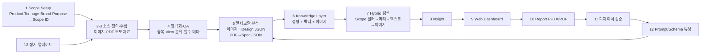

# Design Benchmarking Agent — 프로젝트 기획서

| 항목 | 내용 |
|---|---|
| 리포 | data09-10 |
| 제출자 | 이동철 |
| 직무·소속 | Exterior & Interior Design / 디자인팀(연구개발) |
| 과정 | 현장 데이터 디지털화 전문가과정 1차수 |
| 작성일 | 2026-09-28 (v0.2 · v0.3 · v0.4 개정 2026-09-29) |
| 문서 상태 | 초안 v0.4 — 수강생 제출 자료 + 2026-09-29 추가 요청(Mecalac·Insight·Report·전문가 피드백·운영 루프) 반영, 추가 과제 B(자동 업무보고 Agent), 오후 답변(점수 0~5·평가 포함 리포트·주간·15년·Mecalac 전 장비) 확정 (11장) |

> **이 리포에는 과제가 두 개 있습니다.** 이 문서는 **과제 A — Design Benchmarking Agent** 입니다. 2026-09-29 에 추가로 제출한 **과제 B — 자동 업무보고 Agent** 는 [`docs/02_과제B_업무보고Agent_기획서.md`](02_과제B_업무보고Agent_기획서.md) 에 따로 정리했습니다(11장 끝 「추가 제출 — 과제 B」).

> 제출자는 이미 15쪽 분량의 구축 기획서(Revision 3.0, 2026.09.19)와 13개 화면짜리 웹 프로토타입(HTML + 화면 캡처 13장)을 냈습니다. 이 문서는 그 내용을 **개발 명세로 옮기면서, 지금 가진 자료로 먼저 만들 범위를 좁히는 것**에 초점을 둡니다.

---

## 1. 추진 배경과 현안

Design Research 단계의 경쟁사 Design Benchmarking을 자동화하려는 과제입니다.

현재는 경쟁사 웹사이트·카탈로그·전시회·보도자료·이미지·스펙 시트를 개별로 검색·다운로드·분석합니다. 수치 제원 매핑, 캡 시야성·비례 분석, CMF 트렌드 추적에 시간이 많이 들어 선행 디자인에 쓸 시간이 줄어듭니다.

제출자가 정리한 Pain Point:

| Pain Point | 현상 | Agent 도입 방향 |
|---|---|---|
| 자료 분산 | 웹/PDF/이미지/보도자료가 서로 다른 위치에 존재 | Collection Agent + 중앙 Knowledge Layer |
| 뷰·스케일 불일치 | 촬영각과 표현 방식이 달라 실루엣·비례 비교가 번거로움 | View Taxonomy + Normalization |
| 정성 정보 비표준화 | "강인함", "슬림한 필러" 등 디자인 언어가 개인별로 다름 | 표준 Taxonomy / Schema / Labeling |
| 재사용성 부족 | 개인 PC·PPT 중심 축적 | 검색 가능한 DB + Vector Index |
| 근거 연결 부족 | AI 분석과 실제 제원·원문이 분리 | Source / Evidence / Confidence 필드 |
| 업데이트 비용 | 신제품 출시·변경 시 동일 조사 반복 | Scheduled Update + Change Detection |

## 2. 목표

### 최종 목표

"경쟁사 장비 이미지를 모아 보여주는 사이트"가 아니라, 사용자가 Benchmarking 시작 시 **Product Type · Tonnage · Competitor Brands · Benchmark Purpose**를 고르면 그 Scope에 맞는 데이터를 수집·분석·검색하고 디자인 의사결정을 지원하는 **Design Research & Decision Support System**입니다. 제출자 기대산출물은 Web 페이지 형태의 Benchmarking Agent로, 다음 네 가지를 포함합니다.

- 자료 수집 및 보유 데이터 Status Dashboard
- 경쟁사별 Exterior & Interior 비교 분석 페이지
- Benchmarking Report 생성
- 정기 업데이트

### 1차 개발 목표

제출 기획서의 Phase 1(PoC) 중 **자동 수집(크롤링)과 VLM 분석을 뺀 "지식 베이스 + 탐색·비교 화면"** 을 먼저 만듭니다.

- Scope Setup(14개 경쟁사 — 부록 B 13개사 + Mecalac(v0.2) · Excavator/Wheel Loader · 장비군별 Tonnage · Purpose) → Scope ID 생성
- 디자이너가 이미 가진 자료(이미지·PDF·엑셀)를 **표준 Schema에 맞춰 등록**하는 화면과 엑셀 일괄 가져오기
- Status Dashboard(브랜드×Tonnage별 보유 자료 현황), Card Gallery, Side-by-Side 비교, Detail(근거·출처)
- 선택 모델로 Benchmark 요약표를 만들어 내보내기

## 3. 보유 데이터

| 데이터 | 형태 | 규모·주기 | 비고(민감도 등) |
|---|---|---|---|
| 경쟁사 이미지 | JPEG / PNG | 미확인 | 촬영각(View)이 제각각. 이미지 사용권은 법무 검토 대상이라고 제출자가 명시 |
| 카탈로그·스펙 시트 | PDF | 미확인 | 제원(운전중량·엔진출력·치수·버킷용량 등) 추출 원천 |
| 정리 자료 | 엑셀 파일 | 미확인 | 열 구성 미확인 |
| 각종 문서 | 문서 파일 | 미확인 | 개인 PC·PPT 중심 축적(제출 기획서) |
| On-line 보도자료 | 웹 | 수시 (정기 업데이트 대상, 주간/월간 제안) | 공개 자료이나 수집·저장·재배포 범위 검토 필요 |
| 경쟁사 Universe | 목록 | 14개사 | CAT, Komatsu, XCMG, John Deere, Liebherr, Sany, Volvo CE, Hitachi, JCB, Bobcat, Kubota, Yanmar, Kobelco (부록 B 13개사) + **Mecalac (2026-09-29 수강생 요청, 11장)** |
| Tonnage 분류 | 표 | Excavator 6단계 · Wheel Loader 5단계 | 부록 C. 예: Medium Excavator 10톤~35톤 미만, Medium Wheel Loader 12톤~25톤·버킷 2.5~5.0 m³ |
| 데이터 Schema 초안 | 필드 목록 | 10개 블록 | Identity / Source-Provenance / Media / Design / Cabin-HMI / CMF / Engineering / Service-Safety / AI-Evidence / Benchmark Scope (6절) |

> 웹 프로토타입의 모델명·이미지는 README에 "representative/generated UI data"라고 적혀 있어 실제 수집 데이터가 아닙니다.

## 4. 해결 방안 개요

제출 기획서의 흐름: 초기 Benchmark Scope 선택 → 경쟁사/톤수별 데이터 수집 → 구조화·멀티모달 분석 → Hybrid Retrieval/RAG → Web → Report → 검증·튜닝 → 정기 업데이트.

**1차 개발 범위**: 위 흐름에서 1(Scope) → 수동 등록(2-3 대체) → 4의 필수 메타 점검 → 6(브라우저 내 저장) → 7의 필터 검색 → 9(대시보드) → 10(요약표 내보내기). 5·8·12·13은 2단계 이후입니다.

설계 원칙(제출 기획서): **제원(FACT)과 AI 관찰(OBSERVATION)을 분리하고, 원본 출처·evidence·confidence를 함께 저장합니다.** 1차 개발에서도 이 구분을 데이터 구조에 그대로 둡니다.

## 5. 주요 기능

| 기능 | 설명 | 우선순위 |
|---|---|---|
| Scope Setup | Product Type(Excavator/Wheel Loader) 선택 시 해당 Tonnage 옵션만 표시, 14개사 Multi-select(v0.2 Mecalac 추가), Purpose 선택 → Scope ID 생성 | MVP |
| 자료 등록 | 모델 1건 = Identity + Engineering(FACT) + Design/CMF/Cabin 태그 + 이미지(View 지정) + Source URL·수집일 | MVP |
| 엑셀 일괄 가져오기 | 기존 엑셀 정리 자료를 열 매핑해 Schema로 변환 | MVP |
| 필수 메타 점검 | brand/model/category/collected_at/source URL/image path 누락 표시(Data Completeness) | MVP |
| Status Dashboard | 브랜드 × Tonnage별 보유 모델 수·이미지 수·View 보유 현황·최근 수집일 | MVP |
| Card Gallery | 이미지 Grid + 핵심 스펙·태그, Scope·브랜드·연식 필터 | MVP |
| Side-by-Side | 선택 모델 2~4개의 이미지(같은 View끼리)·CMF·Cabin·Spec 나란히 비교 | MVP |
| Detail / Evidence | 원본 이미지, 제원, 태그, Source URL, 입력자·검증 상태 | MVP |
| Report 내보내기 | 선택 모델 비교표를 Excel·인쇄용 PDF로 출력 | MVP |
| Insight 페이지 (v0.2) | 브랜드별 요약·평가 점수 비교·강약점·Design Tag 트렌드·White Space, AI 요약 반자동 | MVP(v0.2) |
| Benchmarking Report (v0.2) | 인사이트·비교·피드백·운영 상태를 묶은 보고서 화면, 인쇄·PDF·xlsx·HTML | MVP(v0.2) |
| 전문가(디자이너) 피드백 (v0.2) | 리포트 항목·모델별 평가(1~5)·코멘트·작성자·시각 기록, 반영 상태 | MVP(v0.2) |
| 정기 업데이트·운영 루프 (v0.2) | 주기·마지막 갱신일·다음 예정일, 오래된 자료 경고, 사이클 단계 체크·이력 (자동 재수집은 확장) | MVP(v0.2) |
| Moodboard | 이미지 Pinning, 그룹화, 메모, Export | 확장 |
| Trend Matrix | 연식/브랜드/장비군별 CMF·Design Tag 변화 | 확장 |
| VLM 분석 | 이미지 → Exterior/Cabin/CMF JSON, confidence, "AI observation" 표시 | 확장 |
| Spec Extractor | PDF 카탈로그 → 운전중량·출력·치수·버킷용량 JSON, 원문 대조 | 확장 |
| Hybrid 검색·Insight Chat | 자연어 질문 + Scope 필터 + 텍스트/이미지 유사도, 근거 연결 요약 | 확장 |
| 자동 수집 | OEM 공식 사이트·Press 포털 수집 + provenance | 확장 |
| 정기 업데이트 | 주간/월간 재수집, 신규 모델 감지, 변경분 재분석 | 확장 |
| Designer Validation → Tuning | 검수 로그를 Prompt/Schema/Taxonomy 개선으로 되먹임, 버전관리 | 확장 |
| PPTX 자동 생성, 권한·감사 로그 | Enterprise 단계 | 확장 |

## 6. 기대 산출물

제출 기획서 17절의 11개 산출물 중 단계별 대응:

| 제출 기획서 산출물 | 1단계 | 이후 |
|---|---|---|
| 01 Benchmarking Knowledge Base | 수동 등록·엑셀 가져오기 기반 KB (Scope ID 포함) | 임베딩·벡터 색인 |
| 02 Data Collection Agent | — | 자동 수집 + provenance |
| 03 Normalize & QA Module | 필수 메타 누락 점검 | 중복 제거·View 자동 분류·Review Queue |
| 04 Multimodal Analysis Agent | — | 이미지/문서 → JSON |
| 05 Retrieval & Insight Agent | 조건 필터 검색 | Hybrid Retrieval + 인사이트 |
| 06 Web Dashboard | Scope·현황·Gallery·Side-by-Side·Detail | Moodboard·Trend·QA Admin |
| 07 Report Generator | 비교표 Excel/PDF | PPTX 자동 생성 |
| 08~10 Tuning·Scheduled Update·QA & Governance | Schema 버전 표기만 | 전체 |
| 11 DX Roadmap | 과정 DAY6 산출물 | — |

## 7. 기술 구성

| 과정 도구 | 적용 (제출 기획서 16절 기준) |
|---|---|
| DAY1 | Benchmark Scope Selection, Data Inventory, Collection Plan, Labeling Guideline (View·Tag 기준 확정) |
| DAY2 코랩(Python) | Data Cleaning, Standard Schema, 스크립트로 엑셀 자료 정리, Scope별 시각화 |
| DAY3 멀티모달 | Image → Feature JSON, PDF → Structured Data (VLM 분석 PoC) |
| DAY4 RAG(Dify·NotebookLM) | Design Benchmarking Knowledge Base, Insight Agent (카탈로그·보도자료 질의) |
| DAY5 Make | 신규 모델 감지 → 분석 → 대시보드 갱신 → 알림/리포트 |
| DAY6 | ROI, DX Roadmap, Scope 확장 전략 |

**개발 형태**

- 제출 기획서는 PoC를 Streamlit, 고도화를 Next.js/React, 저장소를 PostgreSQL + pgvector, 이미지 저장소를 NAS 또는 S3/R2/MinIO로 제안했습니다.
- **1단계는 설치가 필요 없는 브라우저 기반 정적 웹 도구**로 제안합니다(가정). 제출자가 이미 HTML 프로토타입을 만들었으므로 그 화면 구성과 이어지고, 서버 없이 사내 PC에서 바로 열어 볼 수 있습니다.
  - 데이터는 브라우저 저장소에 두고, **JSON/Excel 파일로 내보내기·가져오기**해 팀원 간 공유합니다.
  - 이미지는 파일로 불러와 브라우저에 보관합니다(용량 한계 있음 — 팀 공용 운영은 2단계에서 저장소 결정).
- 2단계에서 VLM 분석과 자동 수집을 붙일 때 서버가 필요해지며, 그 시점에 제출 기획서의 구성(Python 수집기 + DB + 벡터 색인)으로 옮깁니다. 외부 VLM으로 이미지를 보낼 범위는 사내 보안정책 검토 대상입니다(제출자 명시).

## 8. 개발 단계

### 1단계 — 지금 바로 개발 가능한 부분

제출 자료만으로 확정된 것이 많아 바로 만들 수 있습니다.

1. **Scope Setup 화면** — 13개사 목록(부록 B, v0.2 에서 Mecalac 추가로 14개사), Excavator 6단계·Wheel Loader 5단계 Tonnage(부록 C), Purpose 목록, Scope ID 규칙(프로토타입의 `EXC-MED-006` 형식 참고).
2. **데이터 구조** — 6절 Schema 10개 블록을 그대로 필드로 정의하고 FACT/OBSERVATION 구분, `schema_version` 표기.
3. **자료 등록 + 엑셀 가져오기** — 이미지 View 분류(Side / Front-Quarter / Rear / Cabin / CMF Detail — 18절 예시)를 선택 항목으로.
4. **Status Dashboard · Card Gallery · Side-by-Side · Detail** — 프로토타입 09 Web Dashboard 화면 구성을 따름.
5. **비교표 내보내기** — Excel, 인쇄용 PDF.
6. 시연 데이터는 **가상의 모델명·도형 이미지**로 채웁니다(프로토타입과 같은 방식). 실제 경쟁사 이미지는 사용권 검토 후 제출자가 넣습니다.
7. **(v0.2, 2026-09-29 추가)** Mecalac 추가(14개사), 평가 점수 4축, 07 Insight · 08 Benchmarking Report · 09 전문가 피드백 · 10 운영 루프 — 11장.

### 2단계

- 코랩에서 PDF 카탈로그 → 제원 JSON 추출(Spec Extractor), 이미지 → Design/CMF 태그 JSON(VLM) PoC. 결과는 "AI observation"으로 표시하고 디자이너가 확정.
- Dify/NotebookLM으로 카탈로그·보도자료 질의(Insight) PoC.
- 팀 공용 저장소 결정(사내 NAS 등), Moodboard·Trend Matrix.
- 제출 기획서 Phase 1 Exit Criteria: "서로 다른 2~3개 Scope 조합에서 핵심 Use-case가 정상 작동하고 결과의 근거 추적이 가능".

### 3단계

- 자동 수집 + 정기 업데이트(Make 또는 스케줄러), 신규 모델 감지, Hybrid Retrieval(Scope 필터 → 메타 → 텍스트 → 이미지 벡터), Designer Validation → Tuning 루프, PPTX 자동 생성, 권한·감사 로그 (제출 기획서 Phase 2·3).

## 9. 기대 효과

- 흩어진 경쟁사 자료가 Scope 기준으로 한곳에 모이고 다시 쓸 수 있게 됩니다.
- 디자인 언어·태그가 표준 Taxonomy로 통일되어 개인별 표현 차이가 줄어듭니다.
- 모든 비교 결과에 출처·근거가 붙어 보고와 의사결정 근거가 명확해집니다.
- 신제품 출시 때마다 같은 조사를 반복하던 비용이 정기 업데이트로 줄어듭니다.
- 제출자는 절감률을 수치로 제시하지 않았고, **PoC에서 같은 과업의 Before/After를 직접 측정**하겠다고 했습니다. ROI 기본식: (Before Hours − After Hours) × 적용 건수 × 시간당 인건비 − 시스템 운영비용.

## 10. 확인 필요 사항

1. 제출 기획서 부록 A가 근거로 든 원문 자료(`Automotive Design Benchmarking Scope.docx`, `Benchmarking Agent 기획 자료-01~03.docx`, `Excavator _ Wheel loader 등을 제조하는 건설장비 디자인에서 주로 다루.docx`, `건설기계 주요 경쟁사.docx`, `굴착기, 휠로더의 Tonage별 구별.docx`)는 이번에 받지 못했습니다. 특히 **Design Tag·Taxonomy 세부 목록**이 담긴 문서가 있으면 받고 싶습니다.
2. 현재 보유 자료의 규모 — 브랜드별 이미지 수, PDF 수, 엑셀 파일의 열 구성 샘플 1건.
3. 1단계 시연용 실제 자료 1~2개 Scope 분(예: Medium Excavator × 3개사) — 사내 사용 범위 안에서.
4. 표준 Design Tag 초안(4대 분석축 + Serviceability/Safety 보조축의 태그 목록) 확정 여부.
5. Image View Taxonomy 최종안(18절 예시 5종으로 충분한지).
6. Scope ID 규칙 확정(프로토타입의 `EXC-MED-006-TT`, `SB-2026-0919-001` 두 형식 중 무엇을 쓸지).
7. 1단계를 팀원이 함께 써야 하는지(공용 저장소 필요) 아니면 개인 PC 도구로 시작해도 되는지.
8. 경쟁사 웹 데이터 수집·이미지 사용권, 외부 VLM 전송 범위에 대한 법무/보안 검토 진행 상황(제출자 명시 사항).
9. Benchmark Report의 현재 양식(PPT 1장 보고 등) 샘플.

## 11. 2026-09-29 수강생 추가 요청

### 원문 (패들릿, 2026-09-28T23:59Z 「Agent Proto」 게시물 댓글)

> - 주요 경쟁사에 'Mecalac' 1개 브랜드 추가 (13개 브랜드-->14개 브랜드)요청드립니다.
> - BM결과에 대한 인사이트 페이지 / Benchmarking Report / 분석 및 리포트에 대한 전문가(디자이너) 피드백 / 정기 업데이트 및 운영루프 등이 추가되면 좋을 것 같습니다. ( Proto Web 참조))
> - 기획서 기반의 'End to End Process' Proto Web Index를 업로드했습니다.

첨부된 Proto Web(`docs/source/2026-09-29_AgentProto_index.html`)은 1단계 때 받은 프로토타입 zip 안의 `index.html` 과 같은 파일입니다. 13단계 흐름 화면이며 모델명·수치는 프로토타입용 생성 값입니다. 실명·사내 기밀은 없어 원본 그대로 보관했습니다.

### 반영 방식

| 요청 | 반영 | 비고 |
|---|---|---|
| Mecalac 추가 (13 → 14개사) | 경쟁사 목록(`js/logic.js` BRANDS)·예시 데이터(가상 모델 1건 `예시-MW12`)·DB 제약(`supabase/schema.sql`)·검증 하네스·README·이 문서를 모두 갱신. 화면의 개수는 목록 길이에서 계산 | 본사 표기 「프랑스」, 별칭 메카락·메칼락 |
| 인사이트 페이지 | 메뉴 **07 Insight** — 브랜드별 요약(모델 수·평가 평균·운전중량 범위·출력 대비 중량·주요 태그·최근 수집일), 점수 비교(축 평균 대비 차이), 강·약점 자동 추출(±0.5점, 출력 대비 중량 ±10%), Design Tag 트렌드, White Space, 요약 코멘트 | 점수를 매길 칸이 없어 **디자이너 평가 점수 4축(1~5)** 을 Schema 에 추가(v0.2). 인사이트 문장은 AI 없이 계산으로 만들고, AI 요약은 반자동(프롬프트 복사 → 답 붙여 넣기) |
| Benchmarking Report | 메뉴 **08 Benchmarking Report** — 9개 항목 보고서 화면, 인쇄·PDF 저장, xlsx(8개 시트), HTML 파일 한 개로 내려받기 | PPTX 자동 생성은 3단계 그대로 |
| 전문가(디자이너) 피드백 | 메뉴 **09 전문가 피드백** — 리포트 항목·모델별 평가(1~5)·분류·코멘트·작성자·작성 시각 기록, 「반영됨」 상태 전환. 리포트 각 항목에 「이 항목에 피드백」 버튼 | 기록은 고치지 않고 쌓음(DB 에서도 내용 수정·삭제 불가) |
| 정기 업데이트·운영 루프 | 메뉴 **10 운영 루프** — 주기(주간·격주·월간·분기), 마지막 갱신일·다음 예정일, 수집일 기준 오래된 자료 경고, 사이클 7단계 체크, 완료 이력. 예정일이 지나면 왼쪽 메뉴에 표시 | 자동 재수집·신규 모델 감지는 서버가 필요해 3단계. 지금은 「언제 무엇을 다시 볼지」 알려 주는 방식 |

### Proto Web 흐름과 도구 메뉴 대응

| Proto 단계 | 내용 | 도구 메뉴 | 지금 상태 |
|---|---|---|---|
| 01 Scope Setup | 장비군·톤수·경쟁사·목적 | 01 Scope Setup | 완료 (14개사) |
| 02 Target Sources | 공식 웹·전시·미디어·카탈로그 소스 | 05 자료 등록의 Source 블록(유형·신뢰도) · 10 운영 루프 「수집·등록」 단계 | 소스 자동 구성은 3단계 |
| 03 Collection | 이미지·PDF·텍스트 수집 | 05 자료 등록 · 06 가져오기(엑셀·CSV) | 수동·일괄 가져오기. 자동 수집은 3단계 |
| 04 Normalize & QA | View 분류·중복·필수 메타 | 02 Status Dashboard(필수 메타 누락·톤급 불일치) · 05 중복 차단 · 검증 상태 | 완료 |
| 05 Multimodal Analysis | VLM 4대 축 분석 | 05 관찰 블록 + **평가 점수 4축(v0.2)** · 관찰 입력 출처 「AI 관찰」 칸 | 디자이너 입력. VLM 은 2단계 |
| 06 Knowledge Layer | RDB·Vector·Image Store | 브라우저 저장소 · 06 JSON/Excel 백업 · `supabase/schema.sql` | 벡터 색인은 3단계 |
| 07 Benchmark Retrieval | Hybrid 검색 | 03 Card Gallery 필터(Scope·톤급·브랜드·연식·View·검색어) | 조건 검색 완료 |
| 08 Insight Agent | Trend·Positioning·White Space | **07 Insight (v0.2)** | 계산 인사이트 + AI 요약 반자동 |
| 09 Web Dashboard | Gallery·비교·Moodboard | 02 Dashboard · 03 Gallery · 04 Side-by-Side | Moodboard·Trend Matrix 는 2단계 |
| 10 Report & Decision | PPT/PDF 리포트 | **08 Benchmarking Report (v0.2)** · 04 비교표 내보내기 | PDF(인쇄)·xlsx·HTML. PPTX 는 3단계 |
| 11 Designer Validation | 전문가 확인·피드백 | **09 전문가 피드백 (v0.2)** · 모델 검증 상태(미검토/검토중/확정/반려) | 완료 |
| 12 Prompt / Schema Tuning | Prompt·Taxonomy·Schema 버전 관리 | 09 피드백 분류 「Taxonomy·기준 조정」 · 10 운영 루프 「보정 기록」 단계·완료 메모 · `schema_version` | 버전 관리 화면은 3단계 |
| 13 Scheduled Update | 신규 모델 추적·재수집·재색인 | **10 운영 루프 (v0.2)** | 주기·예정일·오래된 자료 경고. 자동 실행은 3단계 |

### 정한 것(가정)과 남은 확인 사항

1. **평가 점수 축** — Exterior 조형 · Cabin/HMI · CMF · Service/Safety 4축, 1~5 정수. 4대 분석축 중 Engineering 은 제원(FACT)으로 비교하므로 점수 축에서 뺐습니다. 축 구성·척도(1~5 / 1~10)를 확인해 주세요.
2. **강·약점 기준** — 축 평균(모델 단위)보다 0.5점 이상 차이, 출력 대비 중량(kW/t) 10% 이상 차이. 팀에서 쓰는 기준이 있으면 맞춥니다.
3. **리포트 항목 9개** — Proto 10 의 목차(Overview · Data & Scope · Design Trend · CMF · Cabin/HMI · Design Target)와 다릅니다. 현재 보고 양식(10장 9번) 샘플을 주시면 항목을 맞춥니다.
4. **피드백 분류** — Proto 11 의 4종(분석 결과 수정 필요 · 디자인 Tag 보정 · Taxonomy/기준 조정 · 예외 사례 등록) + 「동의(수정 없음)」 · 「추가 분석 요청」.
5. **운영 주기 기본값** — 월간, 오래된 자료 기준 180일. Proto 13 은 주간(월요일 09:00)이었습니다. 팀 운영 주기를 알려 주세요.
6. Mecalac 을 부록 B 와 같은 「주요 경쟁사」로 볼지, 휠형 굴착기·컴팩트 장비 한정으로 볼지(현재는 제한 없이 선택 가능).

### 2026-09-29 오후 답변 반영 (v0.4)

원문(패들릿 댓글, 2026-09-29T02:20Z, 「09-29 반영 결과 · data09-10」 게시물):

> -디자인 평가 지표 및 점수 관련 가이드입니다. 0~5점 구성입니다.-리포트는 디자인 평가 페이지의 내용을 포함해서 평가 페이지를 기반으로 한 Insight를 제공하는 내용이면 될 듯 합니다.-업데이트 주기 ( 주간단위/오래된 자료 15년 )-Mecalac: 모든 장비로 구분

| 확인 사항(위 목록) | 답 | 반영 |
|---|---|---|
| 1. 평가 점수 척도 | **0~5점** | 점수 칸·빠른 입력·가져오기가 0~5 를 받습니다. 0 은 「점수 0」, 빈칸은 「평가 안 함」으로 구분합니다. 예전에 넣은 1~5 점수는 범위 안이라 그대로 유효합니다(데이터 변환 없음). `schema_version` v0.3-stage1, DB 제약 0~5. 축 구성(4축)은 답에 없어 그대로 둡니다 |
| 3. 리포트 항목 | **디자인 평가 페이지 내용을 포함하고, 평가 기반 Insight 제공** | 리포트 항목 10개: 1 Overview · **2 디자인 평가 — 모델별 점수(0~5)** · 3~6 **Insight**(브랜드별 요약 · 평가 점수 비교 · 강·약점 · Design Trend/White Space — 모두 2번 점수로 계산) · 7 요약 코멘트 · 8 선택 비교 · 9 피드백 · 10 신선도·운영. 머리 요약에 「평가 N건/전체, 모델 평균 최고·최저 모델」을 더했습니다. xlsx 에 「디자인평가」 시트 추가(9개 시트). 07 화면의 점수 표 이름도 「디자인 평가 — 모델별 점수(0~5)」로 바꿨습니다 |
| 5. 운영 주기 | **주간 · 오래된 자료 15년** | 기본값 주간·5479일(15년). 기준 상한을 3650일에서 10958일(30년)로 넓혔습니다. 예전 기본값(월간·180일)을 그대로 둔 저장본은 한 번만 새 기본값으로 옮기고, 사용자가 직접 고른 값은 건드리지 않습니다. 예시 데이터도 주간 주기로 바꿨습니다 |
| 6. Mecalac 범위 | **모든 장비로 구분** | 이미 굴착기·휠로더 Scope 어디서나 고를 수 있게 되어 있어 확인됨으로 기록합니다(테스트 추가) |

남은 확인:

1. **디자인 평가 지표·점수 가이드 문서** — 댓글에 「가이드입니다」라고 적혀 있지만 댓글에는 첨부가 없었습니다. 0~5 각 점수의 뜻(예: 0 이 「해당 없음」인지 「매우 미흡」인지)과 평가 지표 목록이 담긴 문서가 따로 있으면 올려 주세요. 받으면 점수 칸 옆에 기준 설명을 붙이고, 축 구성(지금 4축)도 맞춥니다.
2. 「오래된 자료 15년」을 **수집일** 기준으로 적용했습니다. 출시 연도(모델이 나온 해) 기준을 뜻하셨다면 알려 주세요.
3. 전문가 피드백의 평가(1~5)는 디자인 평가 점수와 다른 칸이라 그대로 두었습니다. 같이 0~5 로 맞출지 알려 주세요.
4. 강·약점 기준(2번)·피드백 분류(4번)는 답이 없어 그대로입니다.

### 추가 제출 — 과제 B (자동 업무보고 Agent, v0.3)

2026-09-29T00:48Z 패들릿에 「추가프로젝트 기획서입니다. (자동 업무보고 Agent)」와 함께 「AI 기반 자동 주간·월간 업무보고 생성 Agent 구축 기획서」(기획안 v1.0)가 올라왔습니다.
Design Benchmarking 과 목적·데이터·사용자가 다른 과제라서, data09-08 처럼 한 리포 안에서 과제를 나눴습니다.

| 구분 | 과제 A — Design Benchmarking Agent | 과제 B — 자동 업무보고 Agent |
|---|---|---|
| 기획서 | 이 문서 (`docs/01_프로젝트_기획서.md`) | [`docs/02_과제B_업무보고Agent_기획서.md`](02_과제B_업무보고Agent_기획서.md) |
| 제출 원문 | `docs/source/01_…v3_docx.pdf`, `02_…Prototype.zip` | `docs/source/03_AI_업무보고_Agent_기획서.docx` |
| 도구 | `index.html` (https://aebonlee.github.io/data09-10/) | `report/index.html` (https://aebonlee.github.io/data09-10/report/) |
| 입력 | 경쟁사 장비 이미지·제원·카탈로그 | Outlook 메일(.eml)·붙여 넣은 메일 |
| 저장 | localStorage `data09-10.db` | localStorage `data09-10.report` (따로 저장) |
| 로직·테스트 | `js/logic.js` · `test/logic.test.mjs` | `js/report-logic.js` · `test/report-logic.test.mjs` (`node test/logic.test.mjs` 가 함께 돌림) |
| DB 표 | workspace · benchmark_* · model_media · design_feedback · ops_history | report_period · report_mail(메타만) · report_item · report_carryover · report_history |

두 도구는 왼쪽 메뉴 아래 「과제 A / 과제 B」 링크로 오갑니다. 화면 스타일(`css/style.css`)과 엑셀 라이브러리(`vendor/`)만 함께 씁니다.
과제 B 1단계는 .eml 불러오기 → 업무 그룹 → 실적·계획·이슈(규칙 + AI 반자동, 근거 메일 필수) → 이전 계획 대비 → 주간·월간 초안 → 승인 → Word·Excel·인쇄까지입니다. 자세한 범위와 확인 사항은 과제 B 기획서 8·10장에 있습니다.

## 부록. 제출 원문 요약

| 출처 | 파일/게시물 | 내용 |
|---|---|---|
| 패들릿 게시물 1 (2026-09-21 10:17) | 「Design Benchmarking Agent」 | 직무·현안·보유 데이터 유형·기대 산출물 4종 |
| 패들릿 게시물 2 (2026-09-21 10:20) | 「Design Benchmarking Agent」 | 기획서 기반 Rough Prototype을 웹 페이지 이미지로 검토 |
| 첨부 01 | `att/01___________Design_Benchmarking_Agent__________v3_docx.pdf` (텍스트 추출본 `.pdf.txt`) | 「Design Benchmarking Agent 구축 기획서」 Revision 3.0, 2026.09.19, 15쪽 — 배경·목표·범위·사용자 시나리오·분석 Framework·Data Schema·아키텍처·13단계 Process·Agent 구성·대시보드·QA·로드맵·KPI/ROI·Pilot·6일 과정 연계·산출물·부록 A~C |
| 첨부 02 | `att/02_Design_Benchmarking_Agent_Web_Prototype.zip` → `att/unzipped/` | `index.html`(13단계 화면 프로토타입, 대표 생성 데이터), `README.txt`, `screenshots/page_01~13.png` |
| 패들릿 게시물 3 (2026-09-28 23:59Z) | 「Agent Proto」 + 댓글 | Mecalac 추가, Insight·Report·전문가 피드백·운영 루프 요청, Proto Web 재업로드 — 11장, `docs/source/2026-09-29_패들릿_추가요청.md` |
| 패들릿 게시물 4 (2026-09-29 00:48Z) | 「AI_업무보고_Agent_구축_기획서」 + 첨부 03 docx | **과제 B** 로 분리 — `docs/02_과제B_업무보고Agent_기획서.md` |

게시물 1·2는 같은 과제의 기획과 프로토타입이므로 하나로 합쳤습니다. 읽지 못한 첨부는 없습니다. 다만 첨부 01이 근거로 인용한 원문 docx들은 제출되지 않았습니다(10절 1번).
