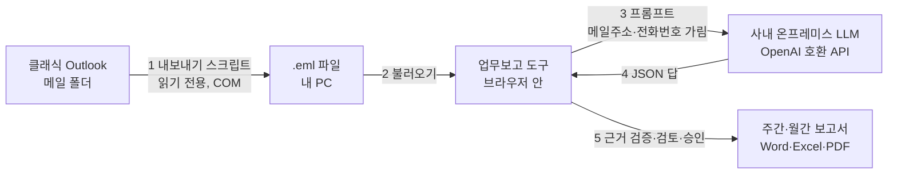

# 과제 B · 자동 업무보고 Agent — 프로젝트 기획서

| 항목 | 내용 |
|---|---|
| 리포 | data09-10 (과제 A Design Benchmarking Agent 와 같은 리포) |
| 제출자 | 이동철 |
| 직무·소속 | Exterior & Interior Design / 디자인팀(연구개발) |
| 과정 | 현장 데이터 디지털화 전문가과정 1차수 |
| 작성일 | 2026-09-29 (v0.2 개정 2026-09-29 오후 늦게, v0.3 개정 2026-09-30) |
| 문서 상태 | 초안 v0.3 — 2026-09-30 사내 LLM 정보 확인 불가 → 반자동 기본 유지 확인, 「회사에서만 실행?」·다운로드·AI 로 고쳐 쓰기 질문 답변 (12장). 이전: 초안 v0.2 — 제출 기획서 반영(v0.1) + 오후 늦게 수강생 답변(클래식 Outlook·Graph 미정·사내 온프레미스 LLM)과 주간업무보고 양식 샘플 반영: 폴더 내보내기 스크립트, OpenAI 호환 AI 연결 설정, 주간 양식 표 (11장) |
| 도구 | `report/index.html` — https://aebonlee.github.io/data09-10/report/ |
| 이어서 | 업무보고 Agent 는 data09-27 에서 자동화판으로 계속 (2026-09-30 요청 — 메일 · 자료 입력 없이 Online · .pst 메일과 첨부 자동 수집) — https://github.com/aebonlee/data09-27 |

> 제출자는 과제 A(Design Benchmarking Agent)와 별도로 「AI 기반 자동 주간·월간 업무보고 생성 Agent 구축 기획서」(기획안 v1.0, 11장)를 올렸습니다. 이 문서는 그 내용을 **개발 명세로 옮기면서, 브라우저 도구로 지금 바로 만들 수 있는 범위를 정하는 것**에 초점을 둡니다. 제출 원문은 `docs/source/03_AI_업무보고_Agent_기획서.docx` 입니다(실명·사내 기밀 없음을 확인하고 보관).
>
> 한 리포 안에서 **과제 A = Design Benchmarking**, **과제 B = 업무보고 Agent** 로 나눕니다. 두 도구는 화면·저장소가 따로이며 왼쪽 메뉴 아래 링크로 오갑니다.

---

## 1. 추진 배경과 현안

업무보고 작성자는 Outlook 메일, 첨부파일, 회의자료, 업무 진행 내역을 하나하나 확인해 취합합니다.
반복 작업이 많고, 메일에 흩어진 진행상황이나 첨부파일의 핵심 정보가 보고서에서 빠질 수 있습니다(제출 기획서 1.1).

| 현안 | 현상 | Agent 도입 방향(제출 기획서) |
|---|---|---|
| 자료 분산 | 메일·첨부·PC 폴더에 업무 정보가 흩어져 있음 | Outlook Online/Local·PC 지정 폴더 통합 수집 |
| 메일 단위 사고 | 회신·전달이 이어지는 한 업무가 여러 메일로 쪼개져 있음 | 메일 단건 요약이 아닌 **업무 단위 통합 분석** |
| 누락 | 진행상황·수치·이슈가 보고서에서 빠짐 | 실적·계획·이슈 자동 분류 + 이전 보고서 계획과 비교 |
| 신뢰성 | AI 요약이 근거 없이 완료·수치를 만들어 낼 위험 | 주요 내용마다 **원본 메일·첨부 근거 연결**, 확인 못 한 것은 확정하지 않음 |
| 반복 작업 | 매주·매월 같은 검색·요약·작성 반복 | 정기 실행 + 사용자 검토·승인 후 저장·전달 |

제출 기획서의 설계 원칙(1.3)은 이 도구의 모든 판단 기준입니다.

1. 메일 단건 요약이 아닌 업무 단위의 통합 분석을 한다.
2. 보고서의 주요 주장과 수치에는 원본 메일 또는 첨부파일 근거를 연결한다.
3. AI 가 확인하지 못한 완료 여부·성과·일정은 임의로 확정하지 않는다.
4. 자동 발송보다 사용자 검토 및 승인을 우선하는 단계적 자동화를 적용한다.

## 2. 목표

### 최종 목표 (제출 기획서 1.2)

| 구분 | 목표 |
|---|---|
| 데이터 수집 | Outlook Online/Local 및 PC 지정 폴더의 업무자료 통합 수집 |
| 내용 분석 | 메일 본문과 이미지·Excel·PowerPoint·PDF 등 첨부파일 분석 |
| 업무 구조화 | 업무 단위로 정보를 연결하고 실적·계획·이슈 자동 분류 |
| 보고서 생성 | Weekly / Monthly 보고서 초안 및 Word·PowerPoint 등 출력 |
| 신뢰성 확보 | 주요 내용의 원본 근거 추적, 검토·승인 절차 제공 |
| 업무 효율화 | 메일 검색·요약·보고서 작성에 드는 반복 업무 절감 |

### 1차 개발 목표 (이번 1단계)

- Outlook 에서 저장한 메일(.eml)을 여러 통 불러와 **브라우저 안에서만** 읽는다(서버·외부 전송 없음).
- 제목 정규화·회신 흐름·프로젝트 키워드로 **업무 단위 그룹핑**을 한다.
- 규칙(낱말) 1차 분류 + AI 반자동(프롬프트 복사 → 답 붙여 넣기)으로 **실적·계획·이슈** 항목을 뽑고, 모든 항목에 **근거 메일 ID** 를 붙인다.
- **이전 보고서 계획 대비** 완료·진행·지연·이월을 제안한다.
- 주간(4.1)·월간(4.2) 섹션 구성으로 **보고서 초안**을 만들고, 사용자가 검토·승인한 뒤 **Word(.docx/.doc)·Excel·인쇄(PDF)** 로 내보낸다.

## 3. 보유 데이터

| 데이터 | 형태 | 1단계에서 쓰는 방법 |
|---|---|---|
| Outlook 메일 | Outlook Online(Exchange) · Local(PST/OST) | 사용자가 메일을 **.eml 로 저장**해 불러온다. 클래식 Outlook 의 `.msg` 는 브라우저가 읽을 수 없어 「텍스트로 저장(.txt)」 또는 **붙여 넣기** 로 받는다 |
| 첨부파일 | 이미지·Excel·PowerPoint·PDF·Word | 1단계는 **파일 이름·형식·크기 목록**만 읽어 근거로 표시한다. 내용 분석은 2단계 |
| PC 지정 폴더 | 파일 경로·수정일 | 브라우저는 폴더를 스스로 훑을 수 없다. 2단계(Python 수집기)에서 다룬다 |
| 이전 보고서 | Word·PPT·메일 | 이 도구에서 승인한 보고서 이력, 또는 이전 보고서의 계획을 **한 줄씩 붙여 넣기** |
| 보고 양식 | 주간업무보고 양식 샘플(PDF 1쪽, v0.2 에서 받음) | 주간 보고서 맨 앞에 **양식 표**(Business Group · 프로젝트명 · 금주 실적 · 차주 계획)를 넣고, 제출 기획서 4.1·4.2 섹션은 상세로 둠 — 11장 |

제출 자료에 실제 메일·보고서 샘플은 없습니다. 1단계 시연은 **가상 메일 9통**(`samples/report/*.eml`, 인물·업무 모두 가상, 주소 example.com)으로 합니다.

## 4. 해결 방안 개요

제출 기획서 5.1 Workflow 9단계와 1단계 도구의 대응입니다.

| 제출 Workflow | 1단계 도구 | 방식 |
|---|---|---|
| 1. 보고 일정 및 기간 설정 | **01 보고 설정** | 주간(월·일요일 시작)/월간, 기준일로 기간 계산, 프로젝트·키워드 등록 |
| 2. 메일·PC 폴더 자료 수집 | **02 메일·자료 입력** | .eml 여러 개 불러오기(끌어 놓기), 붙여 넣기, 중복(Message-ID) 제외 |
| 3. 첨부 텍스트·표·이미지 추출 | 02 (첨부 파일명 목록) | 내용 추출은 2단계 |
| 4. 업무정보 추출·실적/계획/이슈 분류 | **04 실적·계획·이슈** | 규칙 1차 + AI 반자동(업무 JSON, 근거 메일 ID 필수) |
| 5. 업무 그룹핑·중복 제거·이전 보고서 비교 | **03 업무 그룹** · **05 이전 계획 대비** | 회신 흐름(Message-ID/References) + 정규화 제목 + 키워드 / 글자 2-gram 유사도 |
| 6. 근거·기간·상충 정보 검증 | 04 「확인 필요」 탭 · 03 상태 이력 | 기간 밖 근거 제외, 상충 표시, 근거 없음·AI 추론 표시 |
| 7. 주간/월간 보고서 초안 생성 | **06 보고서 초안** | 4.1(주간 4섹션)·4.2(월간 6섹션) + 이전 계획 대비 + 근거 메일 목록 |
| 8. 사용자 검토·수정·승인 | 04 표에서 수정 · 06 승인 | 승인 전 파일에는 「초안」 표시, 승인하면 이력에 계획 저장 |
| 9. Word/PPT/PDF 저장, Outlook 발송 | 06 내려받기 · 인쇄 | Word(.docx·.doc)·Excel·HTML·인쇄(PDF). **발송은 하지 않음**(7.2) |

제출 기획서 5.2 의 역할별 Agent 는 MVP 권장(「단일 워크플로우 안에 역할별 분석 단계」)대로 한 화면 흐름 안의 단계로 구현했습니다.

| 제출 Agent | 1단계 구현 위치 |
|---|---|
| Main Orchestrator | 메뉴 01 → 07 순서 · 확인 필요 알림(메뉴 배지) |
| Mail Analyzer | `parseEml` — 머리글·본문·첨부 목록, 인용문 분리 |
| Document Analyzer | (2단계) — 1단계는 첨부 파일명만 |
| Task Analyzer | `groupTasks` · `taskStatus` — 업무 묶음·최신 상태·변경 이력 |
| Report Writer | `buildReport` · `docxParts` · `reportSheets` |
| Quality Checker | 근거 연결 검사 · 기간 거르기 · `markConflicts` · AI 답 검증(`parseAiItems`) |

## 5. 주요 기능

### 5.1 메일 파서 (.eml)

- 머리글: From·To·Cc·Date·Subject·Message-ID·In-Reply-To·References, 접힌 줄 펴기.
- 제목·이름 인코딩: RFC 2047 `=?charset?B?…?=`·`?Q?`, 인코딩 단어가 여럿으로 나뉜 제목(바이트를 이어 붙여 풀기), 8비트 UTF-8 머리글.
- 문자셋: UTF-8, **ks_c_5601-1987**(Outlook 한국어 기본 = EUC-KR), 그 밖에 브라우저가 아는 문자셋.
- MIME: multipart/alternative·mixed·related 재귀, text/plain 우선(없으면 text/html → 글자), base64·quoted-printable·8bit.
- 첨부: Content-Disposition attachment 또는 이름이 있는 부분 → 이름·형식·크기. RFC 2231 `filename*=UTF-8''…`, 이어붙이기(`filename*0*=`), RFC 2047 name.
- 인용문 분리: `-----Original Message-----`, `---------- Forwarded message ---------`, `From:`/`보낸 사람:` 블록, `>` 줄은 「이번 메일에서 새로 쓴 내용」에서 뺌(분류가 이전 메일 내용을 두 번 세지 않게).
- 날짜: 보낸 쪽 시간대의 날짜로 기간 판정(자정 전후 메일이 다른 주로 넘어가지 않게), UTC 로도 보관.
- `.msg`(OLE 파일): 파일 머리 바이트로 알아보고 건너뛴 뒤 저장 방법을 안내.
- 붙여 넣기: Outlook 에서 복사한 「보낸 사람: / 보낸 날짜: / 받는 사람: / 제목:」 머리글을 읽고, 없으면 사용자가 제목·날짜를 적음.

### 5.2 업무 그룹핑 (제출 기획서 3.3)

- 제목 정규화: `RE:`·`FW:`·`Fwd:`·`회신:`·`전달:`·`답장:`·`RE[2]:` 를 반복해서 떼고, `[외부]`·`[긴급]` 같은 표시는 버리고 `[프로젝트명]` 은 남긴다.
- 같은 업무 = 회신·전달로 이어진 메일(Message-ID/In-Reply-To/References) + 정규화 제목이 같은 메일.
- 프로젝트 = 제목 `[태그]` 와 같은 등록 프로젝트(가장 강함) → 제목·첨부 파일명의 키워드 → 본문 키워드(약함) → 제목 태그 → 「기타」. 화면에서 업무별로 바꿀 수 있음.
- 업무 현재 상태 = 가장 최근 근거의 상태, 상태가 바뀐 이력을 화살표로 보존(「최신 상태 반영, 변경 이력 보존」).

### 5.3 실적·계획·이슈 분류 (제출 기획서 3.1·3.2)

| 분류 | 규칙 1차(낱말) | 상태 |
|---|---|---|
| 이슈 | 지연·차질·문제·리스크·미확정·회신 없음·충돌·보류·누락·결정 필요·우려 … | 지연 / 보류 / 확인 필요, 결정 요청이면 「의사결정」 표시 |
| 계획 | 예정·계획·차주·다음 주·차월·~까지 회신/제출·하겠습니다 … | 예정, 문장 속 날짜(10/2, 10월 2일, 2026-10-02) 추출 |
| 실적 | 완료·마쳤·제출했·선정했·확정했·입고 완료 … | 완료 |
| 실적 | 착수했·진행 중·작업 중 | 진행 중 |
| 실적 | 진행했·검토했·협의했·공유했 | **확인 필요**(끝났는지 메일만으로는 모름 — 원칙 3) |

- 「완료 예정」처럼 완료와 예정이 함께 있으면 계획으로 봅니다.
- 같은 업무 안에서 「완료」와 비슷한 내용의 「지연」 이슈가 함께 있으면 둘 다 **상충 — 확인 필요**로 표시합니다(7.2 「상충 정보는 양쪽 근거 제시」).
- AI 반자동: 프롬프트에 기간·프로젝트·규칙 8개(업무 단위로 묶기, 근거 ID 필수, 메일에 없는 수치·날짜 만들지 않기, 불분명하면 확인 필요, 명시/추론 구분, 상충 표시, 의사결정 표시)와 메일(기간 안, 새로 쓴 내용, 1,200자까지)을 넣습니다. **메일주소·전화번호는 기본으로 가립니다**(7.1 마스킹). AI 답은 JSON 배열로 받아 **없는 메일 ID 는 지우고, 허용 밖 상태는 「확인 필요」로, 근거 없는 항목은 「확인 필요」로 낮춥니다.**
- 모든 항목은 표에서 분류·상태·프로젝트·내용·날짜를 고칠 수 있고, 「확인」「제외」 표시를 남깁니다.

### 5.4 이전 보고서 계획 대비

- 이전 계획: 이 도구에서 승인한 바로 앞 기간 보고서의 계획을 가져오거나, 한 줄에 하나씩 붙여 넣기(`[프로젝트] 내용` 형식이면 프로젝트도 읽음).
- 판정 제안: 계획마다 이번 기간 항목 중 가장 비슷한 것(글자 2-gram 유사도, 프로젝트가 같으면 +0.1, 다르면 −0.15, 겹치는 2-gram 3개 이상)을 찾아 — 이슈면 **지연**, 완료 실적이면 **완료**, 완료가 확인 안 된 실적이면 **진행**, 다시 계획으로 나오거나 못 찾으면 **이월**.
- 판정은 「제안」이고 사용자가 「확정」 칸에서 고릅니다. 보고서에는 확정하지 않은 판정에 「제안」 표시가 붙습니다.

### 5.5 보고서 초안·출력 (제출 기획서 4장)

| 주간(4.1) | 월간(4.2) |
|---|---|
| 기간·요약 | Executive Summary |
| 01. Weekly Performance | Monthly Performance(프로젝트별) |
| 02. Next Week Plan | Project Status(업무별 현재 상태·변화) |
| 03. Key Issues & Risks(현황·상태·의사결정·근거 표) | Next Month Plan |
| 참고 — 이전 보고서 계획 대비 | Key Issues |
| 근거 메일 목록 | Decision Required · 이전 계획 대비 · 근거 메일 목록 |

- 요약은 숫자로 계산(메일 수·실적/계획/이슈 건수·완료 확인 건수·지연·의사결정·확인 필요 건수·이전 계획 판정). 직접 쓸 수도 있음.
- 항목마다 근거 메일 ID(E001 형식) 링크 — 화면에서는 원문 메일(새로 쓴 내용·인용문 포함 전체·첨부 목록), 파일 안에서는 근거 메일 목록 표로 이동.
- 표시: 확인 필요 · 상충 · AI 추론(기울임) · AI 추출 · 근거 없음 — 추론은 명시 사실과 시각적으로 구분(7.2).
- 출력(4.3): **Word(.docx)**(우선순위 1, 문단·목록·표로 직접 만든 OOXML), Word(.doc, HTML 방식), **Excel(.xlsx)**(요약·업무항목·업무그룹·근거메일·이전계획대비 5시트 — 「업무 데이터 및 이력 관리」), 인쇄·PDF, HTML. PowerPoint 는 2단계.
- 승인: 「승인하고 이력에 남기기」 → 파일의 「초안」 표시가 빠지고, 이 보고서의 계획이 다음 보고의 「이전 계획」이 됩니다. **메일 발송은 하지 않습니다.**

## 6. 기대 산출물

- 브라우저 도구 `report/index.html`(설치 없음, `file://` 로도 동작, 인터넷 없이 동작).
- 주간·월간 업무보고 초안(Word·Excel·PDF·HTML), 근거 메일 목록 포함.
- 업무 데이터 엑셀(항목·업무 그룹·근거 메일 메타·이전 계획 판정) — 이력 관리·PoC 검수 표본으로 사용.
- DB 스키마(`supabase/schema.sql` 과제 B 표 5개) — 팀 공용·정기 실행 단계로 옮길 때 사용.

## 7. 기술 구성

### 1단계 (이번)

- 정적 웹(HTML·CSS·일반 스크립트), 저장은 브라우저 localStorage(`data09-10.report`). 과제 A 와 저장 칸이 다릅니다.
- 순수 로직 `js/report-logic.js`(파서·그룹핑·분류·이월·보고서·docx/xlsx 데이터) — `node test/report-logic.test.mjs` 로 검사.
- .docx 는 `vendor/xlsx.full.min.js` 에 들어 있는 zip 기록기(CFB)로 묶습니다(새 라이브러리 없음).
- **메일은 브라우저 밖으로 나가지 않습니다.** AI 는 기본이 반자동(프롬프트 복사 → 회사가 허용한 AI 에 붙여 넣기)이고, v0.2 부터 사용자가 「AI 연결 설정」에 넣은 OpenAI 호환 주소(사내 LLM)로만 보낼 수 있습니다. 공개 리포라 API 키를 코드에 넣지 않습니다(키는 선택, 사용자가 입력).

### 제출 기획서 6장 권장 기술과의 관계

| 기능 | 제출 권장 | 1단계 | 다음 단계 |
|---|---|---|---|
| 메일 연계 | Microsoft Graph API / Outlook 연동 | .eml 저장 → 불러오기, (v0.2) 클래식 Outlook 폴더 내보내기 스크립트(`tools/outlook`) | PC 로컬 Agent(COM) 또는 Graph API(관리자 승인 필요) |
| 자동화·스케줄 | Power Automate | 사람이 기간마다 실행 | Power Automate 정기 실행·승인 흐름 |
| Local 파일 처리 | Python / Power Automate Desktop | — | Python 수집기 |
| 문서 추출 | Python 문서 처리 | 첨부 파일명만 | python-docx·openpyxl·python-pptx·pdfplumber |
| OCR·이미지 | 승인된 Vision/OCR | — | 승인 서비스 확정 후 |
| AI 분석 | OpenAI / Azure OpenAI | 반자동(프롬프트) + (v0.2) OpenAI 호환 주소로 자동 보내기 — 사내 온프레미스 LLM | PC 로컬 Agent 또는 서버에서 정기 실행 |
| 데이터 저장 | SharePoint List / Dataverse / SQLite | localStorage · JSON 백업 · `supabase/schema.sql` | 사내 정책에 맞는 저장소 |
| 보고서 생성 | Python DOCX/PPTX 템플릿 | 브라우저에서 .docx·.xlsx | 팀 양식 템플릿, PPTX |

### DB 설계 (supabase/schema.sql, 2026-09-29 추가)

| 표 | 내용 |
|---|---|
| `report_period` | 보고서 1건(유형·기간·제목·요약·초안/승인) |
| `report_mail` | 근거 메일 **메타만**(보낸이·날짜·제목·정규화 제목·첨부 파일명·프로젝트·업무 묶음·Message-ID) — **본문 칸이 없다** |
| `report_item` | 실적·계획·이슈 항목(분류·상태·문장·날짜·근거 mail_id 목록·명시/추론·의사결정·상충·확인·제외) |
| `report_carryover` | 이전 계획 대비 제안·확정 |
| `report_history` | 승인 기록(계획 스냅숏) — 쌓기만 하고 고치거나 지울 수 없음 |

메일 본문을 저장하지 않는 이유: 사내 메일에는 기밀·개인정보가 섞여 있고(7.1 「필요 최소한으로 처리」), 보고서에 필요한 것은 항목 문장과 「어느 메일이 근거인가」뿐입니다. 원문이 필요하면 Message-ID·제목·날짜로 Outlook 에서 다시 찾습니다.
DB 제약: 규칙·AI 항목은 근거 메일이 있거나 상태가 「확인 필요」여야 함(원칙 3을 DB 에서도 막음), 분류 3종·상태 6종, 같은 Message-ID 두 번 금지, 승인 상태엔 승인 시각 필수, 남의 보고서에 항목을 끼워 넣지 못함(RLS).

## 8. 개발 단계

제출 기획서 9장(7~9주 PoC)·11.2 Phase 와 맞춘 단계입니다.

### 1단계 — 지금 바로 개발 가능한 부분 (이번에 구현)

제출 자료만으로 흐름·분류 체계·보고서 구성·품질 원칙이 확정되어 있어, 메일 수집 방식만 「사용자가 저장한 .eml」로 바꾸면 바로 만들 수 있습니다.

1. **보고 설정** — 주간/월간, 기준일·주 시작 요일로 기간 계산, 프로젝트·키워드.
2. **메일 입력** — .eml 여러 개(인코딩 제목·multipart·base64·QP·EUC-KR·첨부 이름), .msg 안내, 붙여 넣기, 중복 제외, 기간 안/밖 표시, 원문 보기.
3. **업무 그룹** — 제목 정규화·회신 흐름·키워드, 프로젝트 바꾸기, 현재 상태·변화 이력.
4. **분류** — 규칙 1차 + AI 반자동(근거 ID 검증), 표에서 검토·수정·직접 입력, 확인 필요 모아 보기.
5. **이전 계획 대비** — 이력 또는 붙여 넣기, 완료·진행·지연·이월 제안 → 확정.
6. **보고서 초안** — 주간 4.1 / 월간 4.2 섹션, 근거 링크, 표시(확인 필요·상충·AI 추론), 승인, Word(.docx·.doc)·Excel·인쇄·HTML.
7. **이력·백업** — 승인 이력, JSON 백업·복원, 예시 불러오기.
8. **DB 스키마** — 과제 B 표 5개 + 로컬 PostgreSQL 검증.

### 2단계 — 수집·첨부 분석 PoC (제출 Phase 1 나머지 · Phase 2)

- Outlook 연계 방식 확정 후 수집기: Graph API(Online, 관리자 승인) 또는 Outlook 연동(Local, OST 직접 파싱은 지양 — 제출 기획서 2.1). 결과를 이 도구가 읽는 .eml 또는 JSON 으로 넘김.
- Python 으로 첨부 내용 추출(Excel 표·일정·진행률, PPT 제목·본문, PDF·Word 본문), 이미지 OCR(승인 서비스). 이미지에서 본 내용과 메일 작성자의 설명을 구분(2.2).
- 회사 승인 AI API 로 반자동 → 자동 전환(키는 사내 서버에서만).
- PoC 검증(10.1): 최근 2~4주 메일 100~300건·첨부 50~100개·프로젝트 3~5개로 기존 담당자 보고서와 비교. 이 도구의 Excel 「업무항목」 시트를 검수 표로 씀.
- PowerPoint 보고서(팀장·경영진 보고, 4.3 우선순위 1).

### 3단계 — 운영 자동화 (제출 Phase 3)

- Power Automate 정기 실행·승인 흐름, 승인 후 지정 위치 저장·Outlook 전달.
- 월간 분석·대시보드(수집·분석 건수, 보고서 상태, 오류 현황 — 제출 8장 Dashboard), 실행·열람 로그.

## 9. 기대 효과

- 메일 검색·취합·요약에 쓰던 반복 시간이 줄어듭니다(제출 목표: 작성 시간 70% 이상 절감 — PoC 검증 목표).
- 한 업무의 회신·전달이 하나로 묶여 진행상황이 끊기지 않습니다.
- 이전 계획과 비교해 누락·이월이 드러납니다.
- 모든 항목에 근거 메일이 붙어 보고 내용을 되짚을 수 있고, 확인 못 한 내용이 확정된 것처럼 보고되지 않습니다.

제출 기획서 10장 성공 기준과 1단계에서 잴 수 있는 것:

| 평가 항목(제출) | 목표 | 1단계에서 재는 방법 |
|---|---|---|
| 메일 수집 성공률 | 98% 이상 | 불러온 .eml 중 경고 없이 읽힌 비율(읽지 못한 파일은 이유와 함께 표시) |
| 첨부파일 처리율 | 95% 이상 | 1단계는 파일명 목록만 — 2단계 |
| 업무 분류 정확도 | 90% 이상 | Excel 「업무항목」 시트에 사람이 고친 분류와 규칙·AI 분류를 비교 |
| 중복 업무 통합 정확도 | 95% 이상 | 「업무그룹」 시트를 담당자가 검수 |
| 근거 연결률 | 95% 이상 | 규칙·AI 항목은 구조상 100%(근거 없는 AI 항목은 「확인 필요」로 표시) |
| 작성 시간 절감 | 70% 이상 | PoC 에서 Before/After 측정 |

## 10. 확인 필요 사항

제출 기획서 11.3 「개발 착수 전 확정할 사항」에 1단계에서 정한 가정을 더했습니다.

1. ~~Outlook 사용 환경과 접근 권한~~ — **답: 클래식 Outlook 사용, Graph API 승인 여부는 모름**(v0.2). 클래식 Outlook 폴더 내보내기 스크립트로 대응 — 11장. Graph 승인 여부는 IT 확인이 남음.
2. **대상 메일 폴더** — 디스크 경로가 아니라 **Outlook 안의 메일 폴더**(받은 편지함·하위 폴더·보낸 편지함)를 뜻합니다(v0.2 답변 11장). 어느 폴더를 넣을지, 보낸 편지함을 포함할지 알려 주세요.
3. ~~기존 주간 보고서 양식~~ — **주간 양식 샘플 받음**(v0.2, 11장 반영). 월간 양식은 아직 제출 기획서 4.2 구성입니다.
4. **회사에서 승인한 AI 서비스** — **답: 사내 온프레미스 AI 시스템(오픈소스) 가동 중**(v0.2). 그 서버가 OpenAI 호환 API 를 여는지, 주소·모델 이름·키 필요 여부, 브라우저 호출(CORS) 허용 여부를 IT 에 확인해 주세요 — 11장.
5. **작성·검토·승인 담당자와 배포 대상** — 승인이 본인 확인인지 팀장 결재인지.
6. **업무 분류 기준과 보고 기간** — 주 시작 요일(지금 월요일, 일요일 선택 가능), 월간 기준(달력 월), 보고 기간 밖 메일의 계획을 넣을지.
7. **(1단계 가정) 프로젝트 목록·키워드** — 실제 프로젝트명·별칭을 주시면 그룹핑 정확도가 올라갑니다. 제목 `[프로젝트]` 표기 관행이 있는지도 알려 주세요.
8. **(1단계 가정) 규칙 낱말 목록** — 팀에서 쓰는 표현(예: 「F/U」, 「회신 대기」, 「PMR」)을 알려 주시면 분류 낱말에 넣습니다.
9. **(1단계 가정) 이월 판정 기준** — 유사도 0.3·겹치는 글자쌍 3개. 실제 보고서로 맞춰 봐야 합니다.
10. 시연·검증용 **실제 메일 표본**(사내 사용 범위 안에서, 수강생 PC 에서만) — 리포에는 올리지 않습니다.

## 11. 2026-09-29 오후 늦게 답변 반영 (v0.2)

원문(패들릿 댓글 2026-09-29T04:58Z · 녹색 게시물 04:28Z 「주간업무보고 양식 샘플」): `docs/source/2026-09-29_패들릿_답변_오후늦게.md`

> 1.Outlook 환경 — 웹 / 클래식 둘 다 사용 가능한 것으로 알고있습니다. 저는 웹은 사용해본 적이 없고 클래식을 사용하고 있습니다. Graph API 승인 가능 여/부는 모르겠습니다. 대상 메일 폴더라는 것은 Local PC의 메일 경로는 지칭하는 것인지요?
> 2.회사가 승인한 AI서비스 — 현재 내부 온프레미스 AI시스템을 가동중입니다.(오픈소스도입/가동중) 내부 패쇄망을 통한 LLM(을 사용해서 Outlook에 접근하는 방식으로 Agent설계가 가능한지요?

### 11.1 질문에 대한 답

**Q1. 「대상 메일 폴더」는 로컬 PC 의 메일 경로인가요?**
아닙니다. **Outlook 안의 메일 폴더**(받은 편지함, 받은 편지함 아래 프로젝트별 하위 폴더, 보낸 편지함)를 뜻했습니다. 어느 폴더의 메일을 보고서 근거로 삼을지 — 규칙으로 따로 모으는 폴더가 있는지, 내가 보낸 회신도 넣을지 — 를 여쭤본 것입니다. 디스크의 `.ost`/`.pst` 파일을 직접 읽는 방식은 제출 기획서 2.1 대로 지양합니다.

**Q2. 클래식 Outlook 에서 Graph API 없이 메일을 가져오려면?** — 방법(쉬운 순):

| 방법 | 설명 | 이 도구에서 |
|---|---|---|
| 끌어 놓기 | 메일을 바탕화면에 끌면 `.msg` 가 됨 | 브라우저가 `.msg` 를 못 읽어 「다른 이름으로 저장 → 텍스트(.txt)」나 붙여 넣기로 |
| 내보내기(파일 → 열기 및 내보내기) | PST·CSV 로 폴더째 | PST 는 못 읽고, CSV 는 본문·회신 흐름이 잘려 권하지 않음 |
| **Outlook 폴더 내보내기 스크립트 (구현)** | `tools/outlook/Export-OutlookMail.ps1` — 내 PC 의 클래식 Outlook(COM)에서 고른 폴더(하위 폴더·보낸 편지함 선택)의 기간 안 메일을 `.eml` 로 저장 | 저장 폴더의 `.eml` 을 한 번에 불러오기. 회신 흐름(Message-ID·In-Reply-To·References) 유지 |
| VBA 매크로 | 스크립트 실행이 막힌 PC 용. 폴더의 기간 안 메일을 `.txt` 로 저장 | `.txt` 로 불러오기(회신 흐름은 없음) — `tools/outlook/README.md` 에 코드 |

스크립트는 **읽기 전용**입니다(메일을 옮기거나 지우거나 읽음 표시를 바꾸지 않음 — 테스트가 `.Delete(` `.Move(` `.Save()` `UnRead` `.Send(` 가 없음을 확인). 인터넷·서버 연결이 없고, 첨부 **내용은 저장하지 않고** 이름·크기만 적습니다(도구가 쓰는 것은 첨부 이름). 받는 사람은 표시 이름만 적습니다. 스크립트가 만드는 `.eml` 모양은 `test/fixtures/outlook-export.eml` 로 파서 테스트를 통과합니다(나뉜 인코딩 제목, 이름만 있는 받는 사람 목록, 시간대, 회신 흐름, `size=` 로 적은 첨부 크기). PowerShell 실행 정책·Outlook 보안 확인 창 대응은 README 에 적었습니다. Windows 실기 실행은 수강생 PC 에서 확인이 필요합니다(아래 남은 확인).

**Q3. 사내 폐쇄망 LLM 으로 Outlook 에 접근하는 Agent 설계가 가능한가요?**
**네, 구조적으로 가능합니다.** 메일은 사내 PC 에서 꺼내고, 분류·요약은 사내 LLM 이 하므로 메일이 사내망 밖으로 나가지 않습니다.

- 사내 오픈소스 LLM 서버는 보통 **OpenAI 호환 API**(`…/v1/chat/completions`)를 엽니다. vLLM·Ollama 같은 오픈소스 서버가 이런 호환 API 를 제공합니다(주소·포트·모델 이름은 사내 설정에 따름).
- **구현(이번)**: 「01 보고 설정 → AI 연결 설정」에 **주소(Base URL) · 모델 이름 · 키(선택)** 를 넣으면 「04 실적·계획·이슈」에서 「설정한 AI 서버로 보내기」로 프롬프트를 보내고 답(JSON)을 바로 읽습니다. 고정된 외부 주소는 없습니다. 키는 비워 둘 수 있고(사내 서버가 키 없이 열려 있을 때), 「이 브라우저에 기억」을 켰을 때만 저장됩니다. 과제 A 도 같은 설정을 씁니다. 반자동(복사·붙여 넣기)은 그대로 기본입니다.
- 받은 답은 지금과 같은 검증을 거칩니다 — 없는 메일 ID 는 빼고, 근거 없는 항목·허용 밖 상태는 「확인 필요」로 낮춥니다.
- 조건(IT 확인): ① 서버가 브라우저 호출을 허용(CORS)해야 합니다. ② 이 도구를 https(깃허브 페이지)로 열면 http 주소는 브라우저가 막습니다 — 사내 서버가 http 라면 도구를 내 PC 에서 파일로 열어(`report/index.html` 더블클릭) 씁니다. ③ 모델 이름은 서버에 올라간 이름 그대로.
- 테스트: 요청 모양(주소·모델·키 없으면 인증 머리글 없음)·설정 점검(혼합 콘텐츠·평문 키)·응답 읽기·오류 문장을 `test/ai-endpoint.test.mjs` 로, 가짜 OpenAI 호환 서버를 띄워 브라우저에서 과제 A·B 버튼이 실제로 보내고 답을 받는지 확인했습니다.

**다음 단계 설계 — Agent 가 Outlook 을 직접 읽기**

| 단계 | 방식 | 필요한 것 | 특징 |
|---|---|---|---|
| 지금 | 사람이 스크립트로 내보내기 → 도구 → 사내 LLM | PowerShell 실행 | 설치 없음, 사람이 매주 한 번 실행 |
| 다음 ① | **PC 로컬 Agent (COM)** — 작업 스케줄러가 매주 스크립트 실행 → 사내 LLM 분류 → 보고서 초안 파일 생성 → 사용자가 도구에서 검토·승인 | Python(pywin32) 또는 PowerShell, 사내 LLM 주소 | Graph 승인 없이 가능. PC·Outlook 이 켜져 있어야 함 |
| 다음 ② | **Microsoft Graph API** — 서버가 사용자 메일함을 읽음(앱 등록, `Mail.Read` 권한, 관리자 승인) | IT 승인 | PC 가 꺼져 있어도 됨. Power Automate Outlook 커넥터도 같은 권한 체계 |

어느 쪽이든 결과를 이 도구가 읽는 `.eml`(또는 같은 모양의 JSON)으로 넘기면 분류·근거·보고서 부분은 그대로 씁니다.

### 11.2 주간업무보고 양식 샘플 반영

첨부 PDF(1쪽, 「디자인팀 주간 업무보고 웹보드 샘플 V2」)를 읽었습니다. 과제명은 「OO 모델」「XX 지게차」 같은 자리표시라 실명은 없었지만, 팀 보고 양식 원문이라 **원본은 넣지 않고** 구조만 `docs/source/2026-09-29_주간업무보고_양식_구조.md` 에 옮겼습니다.

| 양식 | 도구 반영 |
|---|---|
| 열: Business Group · 프로젝트명 · 금주 실적(기간) · 차주 계획(기간) | 주간 보고서 맨 앞(요약 다음)에 **「주간 업무보고 — 양식 표」**. 머리의 기간은 양식처럼 **평일(월~금)·점 날짜**(예: 2026.09.28 ~ 2026.10.02). Business Group 은 「01 보고 설정」 프로젝트마다 적는 칸을 새로 둠 |
| 금주 실적 칸: 진행 내용 · 결과물 배포일 · 이슈 사항 · 디자인 결과물 이미지 | 진행 내용 = 실적(완료가 아니면 상태 괄호), 결과물 배포일 = 완료 실적의 근거 메일 날짜, 이슈 사항 = 이슈(의사결정 필요 표시), 결과물 이미지 = 근거 메일의 **이미지 첨부 이름**(없으면 「여기에 디자인 결과물 이미지 삽입」 자리) |
| 차주 계획 칸: 실행 예정 업무 · 일정 · 이슈 사항 | 실행 예정 업무 = 계획, 일정 = 계획 날짜의 처음 ~ 끝, 이슈 사항 = 이전 계획 중 이월·지연 + 의사결정이 필요한 이슈 |
| 문체: 명사로 끝나는 개조식 | 「~했습니다 → ~」「~할 예정입니다 → ~ 예정」「~부탁드립니다 → ~ 요청」「~이 필요합니다 → ~ 필요」「~되고 있습니다 → ~ 중」 변환(`boardStyle`). 원문 문장은 아래 상세 절(01~03)에 그대로 남고, 「01 보고 설정」에서 「메일 문장 그대로」도 고를 수 있음 |
| 출력 | 화면·인쇄(PDF)·HTML·Word(.doc·.docx — 칸 안 줄바꿈 유지)·Excel(「주간보고표」 시트 추가) |

월간 보고서는 양식이 없어 제출 기획서 4.2 구성 그대로입니다.

### 11.3 남은 확인

1. **스크립트 실기 실행** — 수강생 PC(클래식 Outlook)에서 `-ListOnly` 로 먼저 돌려 보고, 폴더 이름·건수가 맞는지, 보안 확인 창이 뜨는지 알려 주세요. 스크립트 실행이 회사 정책으로 막히면 VBA 방법을 씁니다.
2. **사내 LLM 연결 정보** — 2026-09-30 답: **지금은 확인할 수 없음** → 반자동(복사·붙여 넣기)을 기본으로 유지합니다(12장). 알게 되면: OpenAI 호환 API 여부, 주소, 모델 이름, 키 필요 여부, CORS 허용 여부(IT 확인). 받으면 「AI 연결 설정 → 연결 확인」으로 바로 시험할 수 있습니다.
3. **Graph API 승인 가능 여부**(IT) — 다음 단계 ①(PC 로컬 Agent)과 ②(Graph) 중 어느 길로 갈지 정합니다.
4. **Business Group 이름·프로젝트 목록** — 실제 사업 구분과 과제명을 「01 보고 설정」에 넣어 주세요.
5. **결과물 배포일** — 지금은 완료 실적의 근거 메일 날짜입니다. 메일에 「배포」 같은 표현이 따로 있으면 그 날짜를 쓰도록 바꿀 수 있습니다.
6. **이미지 삽입** — 첨부 이미지 파일 자체를 보고서에 넣으려면 첨부 내용까지 꺼내야 합니다(지금 스크립트는 이름만). 필요하면 스크립트에 이미지 첨부 저장 옵션을 붙입니다.

## 12. 2026-09-30 답변·질문 반영 (v0.3)

원문(패들릿 댓글 2026-09-30T00:41Z · 00:49Z · 00:51Z · 01:00Z): `docs/source/2026-09-30_패들릿_답변.md`

> -사내 LLM, 등등의 정보 확인이 불가한 상황입니다.
> -업무보고 Agent: 역시 보안 이슈로 사내에 복귀해서만 실행해볼 수 있는 에이전트인가요?

### 12.1 사내 LLM 정보를 확인할 수 없음 → 반자동 유지

바꿀 것은 없습니다. 원래 기본값이 **반자동(「AI 프롬프트 복사」 → 회사가 허용한 AI 에 붙여 넣기 → JSON 답 붙여 넣기)** 이고, 「AI 연결 설정」은 비워 두면 쓰이지 않습니다. AI 없이도 「규칙으로 분류」만으로 실적·계획·이슈 1차 분류와 보고서 초안이 만들어집니다. 사내 LLM 주소·모델 이름을 알게 되면 그때 「01 보고 설정 → AI 연결 설정」에 넣고 「연결 확인」을 누르면 됩니다(11.1 Q3).

### 12.2 질문 — 회사에 돌아가서만 실행할 수 있나요?

**예시 메일로는 지금 어디서나, 실제 메일은 회사 PC 에서** 실행합니다.

| 어디서 | 무엇으로 | 할 수 있는 것 |
|---|---|---|
| 교육 중 · 개인 PC · 온라인 주소 | 「02 메일·자료 입력 → 예시 불러오기」(가상 메일 9통 + 지난주 가상 보고서), `samples/report/*.eml` | 업무 묶기 · 규칙/AI 반자동 분류 · 이전 계획 대비 · 주간(양식 표)/월간 초안 · 승인 · Word/Excel/PDF — 전 과정 |
| 회사 PC | ZIP 을 풀어 `report/index.html` 을 파일로 열기 + Outlook 에서 저장한 .eml(클래식 Outlook 은 `tools/outlook` 스크립트로 폴더째) | 실제 메일로 보고서 초안. 메일은 그 PC 브라우저 안에서만 읽고 어디에도 보내지 않음 |

실제 업무 메일은 회사 밖(개인 PC·온라인 주소)으로 가져오지 마세요. 파일로 연 도구는 인터넷 없이도 돌아가므로 회사 PC 에서 그대로 쓸 수 있습니다.

### 12.3 질문 — 내려받기 · AI 로 고쳐 쓰기

과제 A 기획서 11장 v0.6 「수강생 질문에 대한 답」 Q3·Q4 와 도구 안 안내 페이지 `guide.html`(왼쪽 메뉴 아래 「내 PC 에서 쓰기 · 고쳐 쓰기 안내」)에 적었습니다. 과제 B 를 고칠 때 볼 파일은 `js/report-logic.js`(분류 규칙·보고서 양식 계산 — 테스트 `test/report-logic.test.mjs`)와 `js/report-app.js`(화면)입니다.

## 부록. 제출 원문 요약

| 출처 | 파일/게시물 | 내용 |
|---|---|---|
| 패들릿 (2026-09-29T00:48Z, 이동철 섹션 녹색 글) | 「AI_업무보고_Agent_구축_기획서」 — 「추가프로젝트 기획서입니다. (자동 업무보고 Agent)」 | 원문 `docs/source/2026-09-29_패들릿_추가요청.md` |
| 첨부 03 | `docs/source/03_AI_업무보고_Agent_기획서.docx` (기획안 v1.0) | 1 개요(배경·목표 6항·설계 원칙 4) · 2 구축 범위(수집 4종·첨부 5종) · 3 분석·분류(분류 3종·추출 항목 8종·연속성 규칙 5) · 4 보고서(주간 4섹션·월간 6섹션·출력 5형식) · 5 Workflow 9단계·Agent 6종 · 6 기술 · 7 데이터·보안·품질(관리 6항·품질 원칙 6) · 8 화면 7종·운영 시나리오 · 9 단계별 계획(5단계 7~9주) · 10 성공 기준 6항·PoC 시나리오 · 11 MVP 범위·Phase 1~3·착수 전 확정 사항 6 |

표 16개를 포함해 첨부 전체를 읽었습니다. 실명·회사명·사내 수치가 없어 원본을 보관했습니다(문서 속성 작성자도 비어 있음).
